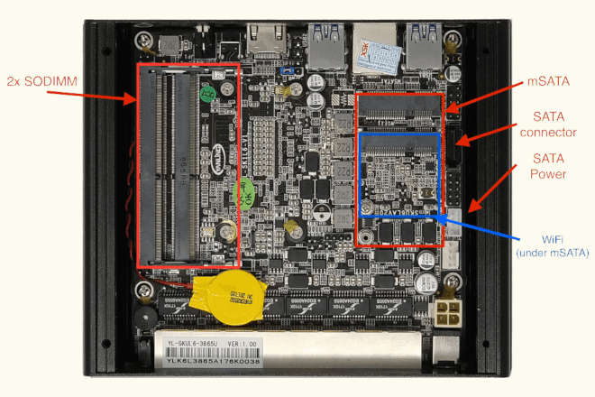

# Protectli Vault FW6 series

This page describes how to run coreboot on the [Protectli FW6].



## Required proprietary blobs

To build a minimal working coreboot image some blobs are required (assuming
only the BIOS region is being modified).

```eval_rst
+-----------------+---------------------------------+---------------------+
| Binary file     | Apply                           | Required / Optional |
+=================+=================================+=====================+
| FSP-M, FSP-S    | Intel Firmware Support Package  | Required            |
+-----------------+---------------------------------+---------------------+
| microcode       | CPU microcode                   | Required            |
+-----------------+---------------------------------+---------------------+
| vgabios         | VGA Option ROM                  | Optional            |
+-----------------+---------------------------------+---------------------+
```

FSP-M and FSP-S are obtained after splitting the Kaby Lake FSP binary (done
automatically by the coreboot build system and included into the image) from
the `3rdparty/fsp` submodule.

Microcode updates are automatically included into the coreboot image by build
system from the `3rdparty/intel-microcode` submodule.

VGA Option ROM is not required to boot, but if one needs graphics in pre-OS
stage, it should be included (if not using libgfxinit).

## Flashing coreboot

### Internal programming

The main SPI flash can be accessed using [flashrom]. The first version
supporting the chipset is flashrom v1.1. Firmware an be easily flashed
with internal programmer (either BIOS region or full image).

### External programming

The system has an internal flash chip which is a 8 MiB soldered SOIC-8 chip.
This chip is located on the bottom side of the case (the radiator side). One
has to remove all screws (in order): 4 top cover screws, 4 side cover screws
(one side is enough), 4 mainboard screws, 4 CPU screws (under DIMMs). Lift up
the mainboard and turn around it. The flash chip is near the SoC on the DIMM
slots side. Use a clip (or solder the wires) to program the chip. Specifically,
it's a Macronix MX25L6406E (3.3V) -[datasheet][MX25L6406E].

## Known issues

- After flashing with external programmer it is always required to reset RTC
  with jumper or disconnect coin cell temporarily. Only then the platform will
  boot after flashing.
- FW6A does not always work reliably with all DIMMs. Linux happens to hang or
  gives many panics. This issue was present also with vendor BIOS.
- Sometimes FSPMemoryInit return errors or hangs (especially with 2 DIMMs
  connected). A workaround is to power cycle the board (even a few times) or
  temporarily disconnect DIMM when platform is powered off.
- When using libgfxinit and SeaBIOS bootsplash, the red color is dim

## Untested

Not all mainboard's peripherals and functions were tested because of lack of
the cables or not being populated on the board case.

- Internal USB 2.0 headers
- Boot with cleaned ME

## Working

- USB 3.0 front ports (SeaBIOS and Linux)
- 6 Ethernet ports
- HDMI port with libgfxinit and VGA Option ROM
- flashrom
- PCIe WiFi
- SATA and mSATA
- Super I/O serial port 0 (RS232 via front RJ45 connector)
- SMBus (reading SPD from DIMMs)
- Initialization with KBL FSP 2.0 (with MemoryInit issues)
- SeaBIOS payload (version rel-1.12.1)
- Mini PCIe debug card connected to mSATA (mSATA slot has LPC signals routed)
- Reset switch
- Booting Debian, Ubuntu, FreeBSD

## Technology

There are 3 variants of FW6 boards: FW6A, FW6B and FW6C. They differ only in
used SoC.

- FW6A:

```eval_rst
+------------------+--------------------------------------------------+
| CPU              | Intel Celeron 3865U                              |
+------------------+--------------------------------------------------+
| PCH              | Kaby Lake U w/ iHDCP2.2 Base                     |
+------------------+--------------------------------------------------+
| Super I/O, EC    | ITE IT8772E                                      |
+------------------+--------------------------------------------------+
| Coprocessor      | Intel Management Engine                          |
+------------------+--------------------------------------------------+
```

- FW6B:

```eval_rst
+------------------+--------------------------------------------------+
| CPU              | Intel Core i3-7100U                              |
+------------------+--------------------------------------------------+
| PCH              | Kaby Lake U w/ iHDCP2.2 Premium                  |
+------------------+--------------------------------------------------+
| Super I/O, EC    | ITE IT8772E                                      |
+------------------+--------------------------------------------------+
| Coprocessor      | Intel Management Engine                          |
+------------------+--------------------------------------------------+
```

- FW6C:

```eval_rst
+------------------+--------------------------------------------------+
| CPU              | Intel Core i5-7200U                              |
+------------------+--------------------------------------------------+
| PCH              | Kaby Lake U w/ iHDCP2.2 Premium                  |
+------------------+--------------------------------------------------+
| Super I/O, EC    | ITE IT8772E                                      |
+------------------+--------------------------------------------------+
| Coprocessor      | Intel Management Engine                          |
+------------------+--------------------------------------------------+
```

[Protectli FW6]: https://protectli.com/vault-6-port/
[MX25L6406E]: https://www.macronix.com/Lists/Datasheet/Attachments/7370/MX25L6406E,%203V,%2064Mb,%20v1.9.pdf
[flashrom]: https://flashrom.org/Flashrom
