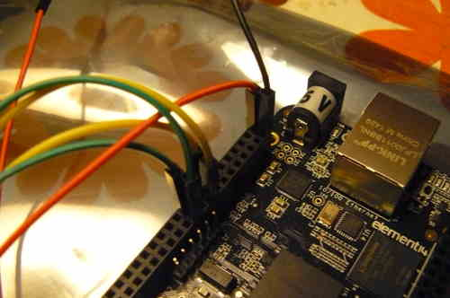

---
title: How to program an SPI flash chip with the BeagleBone Black or Teensy 3.1 
...

This document exists as a guide for reading from or writing to an SPI
flash chip with the BeagleBone Black, using the
[flashrom](http://flashrom.org/Flashrom) software. A BeagleBone Black,
rev. C was used when creating this guide, but earlier revisions may also
work.

***NOTE: Use of BeagleBone black is for example purposes only,
don't buy it unless you want _it_ specifically.*** *There are many ARM
Single Board Computers (SBC) that are capable of in system programming
(external flashing) and they perform similarly terrible at that task.
Common use of devicetrees on those devices allows for configuring them
in similar way, but not identical, so a bit of own research is required.
Lastly SBC is an example of self-contained device that is capable of flashing,
but it's possible to use smaller device like stm32 bluepill
with another computer to achieve similar result.*

*Note: This guide was written for Debian Stretch 9.5, which is the latest
operating system for the BeagleBone Black as of June 2019. It is possible that
these instructions may be outdated if newer operating systems versions
have been released since then.*

There was no justification for a further section for the Teensy. Simply
refer to [this page on
flashrom.org](https://www.flashrom.org/Teensy_3.1_SPI_%2B_LPC/FWH_Flasher#ISP_Usage)
for information about how to set it up, and correlate that with the pins
on the SPI flash chip as per other guides in the libreboot documentation
for each board. At the time of writing, the teensy is tested for
flashing on the ThinkPad X200, but it should work for other targets.
here is a photo of the setup for the teensy:
<http://h5ai.swiftgeek.net/IMG_20160601_120855.jpg>

Onto the Beaglebone black...

Hardware requirements
=====================

Shopping list (pictures of this hardware is shown later):

-   A [Flashrom](http://flashrom.org)-compatible external SPI
    programmer: *BeagleBone Black*, sometimes referred to as 'BBB',
    (rev. C) is highly recommended. You can buy one from
    [Adafruit](https://www.adafruit.com) (USA),
    [ElectroKit](http://electrokit.com) (Sweden) or any of the
    distributors listed on [BeagleBoard's website](http://beagleboard.org/black) (look below
    'Purchase'). We recommend this product because we know that it
    works well for our purposes and doesn't require any non-free
    software.

-   Electrical/insulative tape: cover the entire bottom surface of the
    BBB (the part that rests on a surface). This is important, when
    placing the BBB on top of a board so that nothing shorts. Most
    hardware/electronics stores have this. Optionally, you can use the
    bottom half of a [hammond plastic
    enclosure](http://www.hammondmfg.com/1593HAM.htm#BeagleBoneBlack).
-   Clip for connecting to the flash chip: if you have a SOIC-16 flash
    chip (16 pins), you will need the *Pomona 5252* or equivalent. For
    SOIC-8 flash chips (8 pins), you will need the *Pomona 5250* or
    equivalent. Do check which chip you have, before ordering a clip.
    Also, you might as well buy two clips or more since they break
    easily. [Farnell element 14](http://farnell.com/) sells these and
    ships to many countries. Some people find these clips difficult to
    get hold of, especially in South America. If you know of any good
    suppliers, please contact the libreboot project with the relevant
    information. *If you can't get hold of a pomona clip, some other
    clips might work, e.g. 3M, but they are not always reliable. You can
    also directly solder the wires to the chip, if that suits you; the
    clip is just for convenience, really.*
-   *External 3.3V DC power supply*, for powering the flash chip: an
    ATX power supply / PSU (common on Intel/AMD desktop computers) will
    work for this. A lab PSU (DC) will also work (adjusted to 3.3V).
    -   Getting a multimeter might be worthwhile, to verify that it's
        supplying 3.3V.
-   *External 5V DC power supply* (barrel connector), for powering the
    BBB: the latter can have power supplied via USB, but a dedicated
    power supply is recommended. These should be easy to find in most
    places that sell electronics. OPTIONAL. Only needed if not
    powering with the USB cable, or if you want to use [EHCI
    debug](../misc/bbb_ehci.md).
-   *Pin header / jumper cables* (2.54mm / 0.1" headers): you should
    get male--male, male--female and female--female cables in 10cm
    size. Just get a load of them. Other possible names for these
    cables/wires/leads are as follows:
    -   flying leads
    -   breadboard cables (since they are often used on breadboards).
    -   You might also be able to make these cables yourself.

    [Adafruit](https://www.adafruit.com) sell them, as do many others.
    *Some people find them difficult to buy. Please contact the
    libreboot project if you know of any good sellers.* You might also
    be able to make these cables yourself. For PSU connections, using
    long cables, e.g. 20cm, is fine, and you can extend them longer than
    that if needed.
-   *Mini USB A-B cable* (the BeagleBone probably already comes with
    one.) - *OPTIONAL - only needed for [EHCI
    debug](../misc/bbb_ehci.md) or for serial/ssh access without
    ethernet cable (g\_multi kernel module)*
-   *FTDI TTL cable or debug board*: used for accessing the serial
    console on the BBB. [This
    page](http://elinux.org/Beagleboard:BeagleBone_Black_Serial)
    contains a list. *OPTIONAL\---only needed for serial console on
    the BBB, if not using SSH via ethernet cable.*

Setting up the 3.3V DC PSU
==========================

ATX PSU pinouts can be read on [this Wikipedia
page](https://en.wikipedia.org/wiki/Power_supply_unit_%28computer%29#Wiring_diagrams).

You can use pin 1 or 2 (orange wire) on a 20-pin or 24-pin ATX PSU for
3.3V, and any of the ground/earth sources (black cables) for ground.
Short PS\_ON\# / Power on (green wire; pin 16 on 24-pin ATX PSU, or pin
14 on a 20-pin ATX PSU) to a ground (black; there is one right next to
it) using a wire/paperclip/jumper, then power on the PSU by grounding
PS\_ON\# (this is also how an ATX motherboard turns on a PSU).

*DO NOT use pin 4, 6, do NOT use pin 19 or 20 (on a
20-pin ATX PSU), and DO NOT use pin 21, 22 or 23 (on a 24-pin
ATX PSU). Those wires (the red ones) are 5V, and they WILL kill
your flash chip. NEVER supply more than 3.3V to your flash
chip (that is, if it's a 3.3V flash chip; 5V and 1.8V SPI flash chips
do exist, but they are rare. Always check what voltage your chip takes.
Most of them take 3.3V).*

You only need one 3.3V supply and one ground for the flash chip, after
grounding PS\_ON\#.

The male end of a 0.1" or 2.54mm header cable is not thick enough to
remain permanently connected to the ATX PSU on its own. When connecting
header cables to the connector on the ATX PSU, use a female end attached
to a thicker piece of wire (you could use a paper clip), or wedge the
male end of the jumper cable into the sides of the hole in the
connector, instead of going through the centre.

Here is an example set up:\


Accessing the operating system on the BBB
=========================================

Follow the [Getting Started](https://beagleboard.org/getting-started)
instructions to install the latest version of Debian onto the BBB.
It is recommended to download the eMMC IoT Flasher edition, which will
write its image to the on-board eMMC.

The operating system on the BBB can be accessed over SSH, with username
'debian' and password 'temppwd'. Follow the instructions on the Getting
Started page for complete details.

You will also be using the OS on your BBB for programming an SPI flash
chip.

Alternatives to SSH (in case SSH fails)
---------------------------------------

You can also use a serial FTDI debug board with GNU Screen, to access
the serial console.
    # screen /dev/ttyUSB0 115200

Here are some example photos:\
 \

You can also connect the USB cable from the BBB to another computer and
a new network interface will appear, with its own IP address. This is
directly accessible from SSH, or screen:

    # screen /dev/ttyACM0 115200

You can also access the uboot console, using the serial method instead
of SSH.

Setting up spidev on the BBB
============================

Log in to the BBB using either SSH or a serial console as
described in [\#bbb\_access](#bbb_access).

*Note: The following commands are run as root. To run them from a normal user
account, add yourself to the `gpio` group to configure the pins and the `spi`
group to access spidev.*

Run the following commands to enable spidev:

    # config-pin P9.17 spi_cs
    # config-pin P9.18 spi
    # config-pin P9.21 spi
    # config-pin P9.22 spi_sclk

Verify that the spidev devices now exist:

    # ls /dev/spidev*

Output:

    /dev/spidev1.0  /dev/spidev1.1  /dev/spidev2.0  /dev/spidev2.1

Now the BBB is ready to be used for flashing. The following systemd service
file can optionally be enabled to make this persistent across reboots.

```
[Unit]
Description=Enable SPI function on pins

[Service]
Type=oneshot
ExecStart=config-pin P9.17 spi_cs
ExecStart=config-pin P9.18 spi
ExecStart=config-pin P9.21 spi
ExecStart=config-pin P9.22 spi_sclk
RemainAfterExit=yes

[Install]
WantedBy=multi-user.target
```

Get flashrom from the libreboot\_util release archive, or build it from
libreboot\_src/git if you need to. An ARM binary (statically compiled)
for flashrom exists in libreboot\_util releases. Put the flashrom binary
on your BBB.

You may also need ich9gen, if you will be flashing an ICH9-M laptop
(such as the X200). Get it from libreboot\_util, or build it from
libreboot\_src, and put the ARM binary for it on your BBB.

Finally, get the ROM image that you would like to flash and put that on
your BBB.

Now test flashrom:

    # ./flashrom -p linux_spi:dev=/dev/spidev1.0,spispeed=512

Output:

    Calibrating delay loop... OK.
    No EEPROM/flash device found.
    Note: flashrom can never write if the flash chip isn't found automatically.

This means that it's working (the clip isn't connected to any flash
chip, so the error is fine).

Connecting the Pomona 5250/5252
===============================

Use this image for reference when connecting the pomona to the BBB:
<http://beagleboard.org/Support/bone101#headers> (D0 = MISO or connects
to MISO).

The following shows how to connect clip to the BBB (on the P9 header),
for SOIC-16 (clip: Pomona 5252):

     NC              -       - 21
     1               -       - 17
     NC              -       - NC
     NC              -       - NC
     NC              -       - NC
     NC              -       - NC
     18              -       - 3.3V (PSU)
     22              -       - NC - this is pin 1 on the flash chip
    This is how you will connect. Numbers refer to pin numbers on the BBB, on the plugs near the DC jack.

    You may also need to connect pins 1 and 9 (tie to 3.3V supply). These are HOLD# and WP#.
    On some systems they are held high, if the flash chip is attached to the board.
    If you're flashing a chip that isn't connected to a board, you'll almost certainly
    have to connect them.

    SOIC16 pinout (more info available online, or in the datasheet for your flash chip):
    HOLD    1-16    SCK
    VDD 2-15    MOSI
    N/C 3-14    N/C
    N/C 4-13    N/C
    N/C 5-12    N/C
    N/C 6-11    N/C
    SS  7-10    GND
    MISO    8-9 WP

The following shows how to connect clip to the BBB (on the P9 header),
for SOIC-8 (clip: Pomona 5250):

     18              -       - 1
     22              -       - NC
     NC              -       - 21
     3.3V (PSU)      -       - 17 - this is pin 1 on the flash chip
    This is how you will connect. Numbers refer to pin numbers on the BBB, on the plugs near the DC jack.

    You may also need to connect pins 3 and 7 (tie to 3.3V supply). These are HOLD# and WP#.
    On some systems they are held high, if the flash chip is attached to the board.
    If you're flashing a chip that isn't connected to a board, you'll almost certainly
    have to connect them.

    SOIC8 pinout (more info available online, or in the datasheet for your flash chip):
    SS  1-8 VDD
    MISO    2-7 HOLD
    WP  3-6 SCK
    GND 4-5 MOSI

`NC = no connection`

*DO NOT connect 3.3V (PSU) yet. ONLY connect this once the pomona is
connected to the flash chip.*

*You also need to connect the BLACK wire (ground/earth) from the 3.3V
PSU to pin 2 on the BBB (P9 header). It is safe to install this now
(that is, before you connect the pomona to the flash chip); in fact, you
should.*

if you need to extend the 3.3v psu leads, just use the same colour M-F
leads, *but* keep all other leads short and equal length (30cm or less).
Keep in mind that length isn't inversely proportional to signal quality,
so trying out different lengths will yield different results.
Same goes for spispeed.

You should now have something that looks like this:\
 

Copyright © 2014, 2015 Leah Rowe <info@minifree.org>\
Copyright © 2015 Patrick "P. J." McDermott <pj@pehjota.net>\
Copyright © 2015 Albin Söderqvist\

Permission is granted to copy, distribute and/or modify this document
under the terms of the GNU Free Documentation License Version 1.3 or any later
version published by the Free Software Foundation
with no Invariant Sections, no Front Cover Texts, and no Back Cover Texts.
A copy of this license is found in [../fdl-1.3.md](../fdl-1.3.md)
