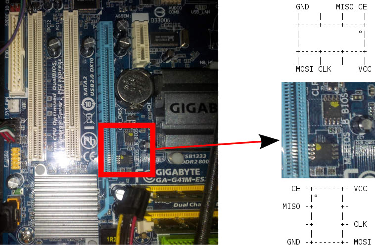

---
title: GA-G41M-ES2L flashing tutorial 
...

This guide is for those who want libreboot on their Intel GA-G41M-ES2L
motherboard while they still have the original BIOS present.

Flash chip size {#flashchips}
===============

Use this to find out:

    # flashrom -p internal

Flashing instructions {#clip}
=====================

Refer to [bbb\_setup.md](bbb_setup.md) for how to set up the BBB for
external flashing. *You can only externally reprogram one of the chips
at a time, and you need to disable the chip that you're not flashing,
by connecting 3v3 to /CS of that chip, so you will actually need second test
clip or IC pin mini grabber.*

Here is an image of the flash chip:\

Internal flashing is possible. Boot with the proprietary BIOS and
GNU+Linux. There are 2 flash chips (one is backup).

Flash the first chip:

    ./flashrom -p internal:dualbiosindex=0 -w libreboot.rom

Flash the second chip:

    ./flashrom -p internal:dualbiosindex=1 -w libreboot.rom

NOTE: you can still boot the system with just the main flash chip
connected, after desoldering the backup chip. This has been tested while
libreboot was already installed onto the main chip.

NOTE: You need the latest flashrom. Just get it on flashrom.org from
their SVN or Git repos.

NOTE: due to a bug in the hardware, the MAC address is hardcoded in
coreboot-libre. Therefore, you must set your own MAC address in your
operating system.

Copyright © 2016 Leah Rowe <info@minifree.org>\

Permission is granted to copy, distribute and/or modify this document
under the terms of the GNU Free Documentation License Version 1.3 or any later
version published by the Free Software Foundation
with no Invariant Sections, no Front Cover Texts, and no Back Cover Texts.
A copy of this license is found in [../fdl-1.3.md](../fdl-1.3.md)
