---
title: Flashing the R400 with a BeagleBone Black 
...

Initial flashing instructions for R400.

This guide is for those who want libreboot on their ThinkPad R400 while
they still have the original Lenovo BIOS present. This guide can also be
followed (adapted) if you brick your R400, to know how to recover.

Before following this section, please make sure to setup your libreboot
ROM properly first. Although ROM images are provided pre-built in
libreboot, there are some modifications that you need to make to the one
you chose before flashing. (instructions referenced later in this guide)

Libreboot T400 {#t400}
==============

You may also be interested in the smaller, more portable [Libreboot
T400](t400_external.md).

Serial port {#serial_port}
-----------

EHCI debug might not be needed. It has been reported that the docking
station for this laptop has a serial port, so it might be possible to
use that instead.

A note about CPUs
=================

[ThinkWiki](http://www.thinkwiki.org/wiki/Category:R400) has a list of
CPUs for this system. The Core 2 Duo P8400 and P8600 are believed to
work in libreboot. The Core 2 Duo T9600 was confirmed to work, so the
T9400 probably also works. *The Core 2 Duo T5870/5670 and Celeron M
575/585 are untested!*

Quad-core CPUs
--------------

Incompatible. Do not use.

A note about GPUs
=================

Some models have an Intel GPU, while others have both an ATI and an
Intel GPU; this is referred to as "Dual Graphics" (previously
"switchable graphics"). In the *BIOS setup* program for lenovobios,
you can specify that the system will use one or the other (but not
both).

Libreboot is known to work on systems with only the Intel GPU, using
native graphics initialization. On systems with switchable graphics, the
Intel GPU is used and the ATI GPU is disabled, so native graphics
initialization works all the same.

CPU paste required
==================

See [\#paste](#paste).

Flash chip size {#flashchips}
===============

Use this to find out:

    # flashrom -p internal

MAC address {#macaddress}
===========

Refer to [mac\_address.md](../hardware/mac_address.md).

Initial BBB configuration
=========================

Refer to [bbb\_setup.md](bbb_setup.md) for how to setup the BBB for
flashing.

The following shows how to connect clip to the BBB (on the P9 header),
for SOIC-16 (clip: Pomona 5252):

    POMONA 5252 (correlate with the BBB guide)
    ===  ethernet jack and VGA port ====
     NC              -       - 21
     1               -       - 17
     NC              -       - NC
     NC              -       - NC
     NC              -       - NC
     NC              -       - NC
     18              -       - 3.3V (PSU)
     22              -       - NC - this is pin 1 on the flash chip
    ===  SATA port ===
    This is how you will connect. Numbers refer to pin numbers on the BBB, on the plugs near the DC jack.

The following shows how to connect clip to the BBB (on the P9 header),
for SOIC-8 (clip: Pomona 5250):

    POMONA 5250 (correlate with the BBB guide)
    ===  RAM slots ====
     18              -       - 1
     22              -       - NC
     NC              -       - 21
     3.3V (PSU)      -       - 17 - this is pin 1 on the flash chip
    ===  slot where the AC jack is connected ===
    This is how you will connect. Numbers refer to pin numbers on the BBB, on the plugs near the DC jack.

Disassembly
-----------

Remove all screws:\
\
Remove the HDD and optical drive:\
\
Remove the hinge screws:\
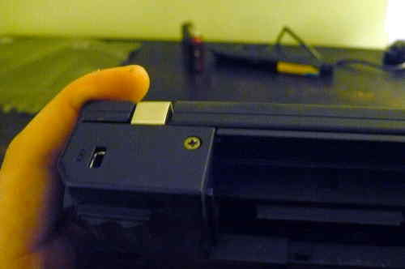 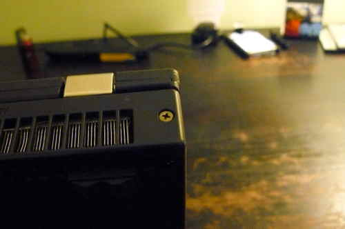

Remove the palm rest and keyboard:\
 

Remove these screws, and then remove the bezel:\
 

Remove the speaker screws, but don't remove the speakers yet (just set
them loose):\
 
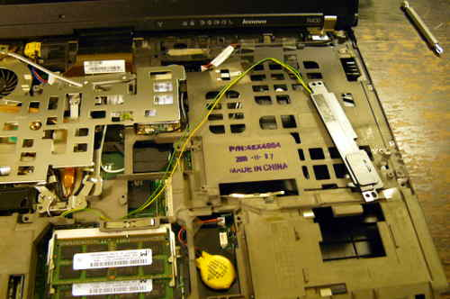

Remove these screws, and then remove the metal plate:\
 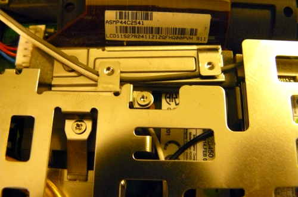
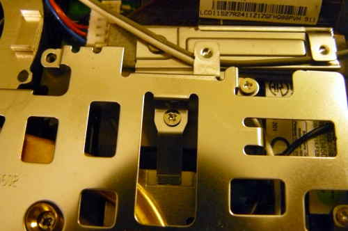

Remove the antennas from the wifi card, and then start unrouting them:\
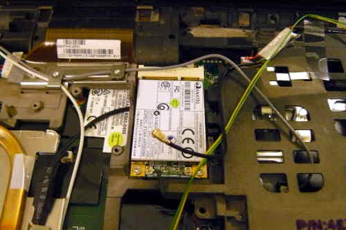 
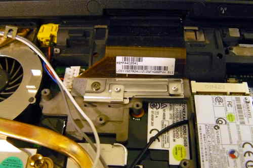 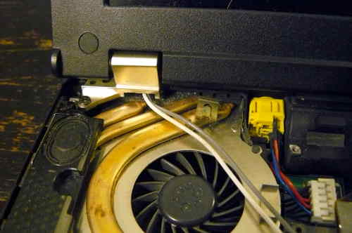
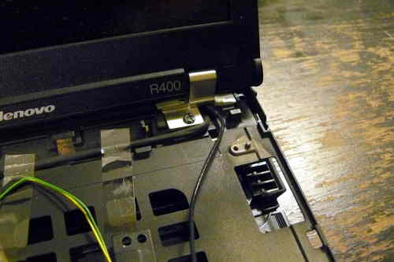 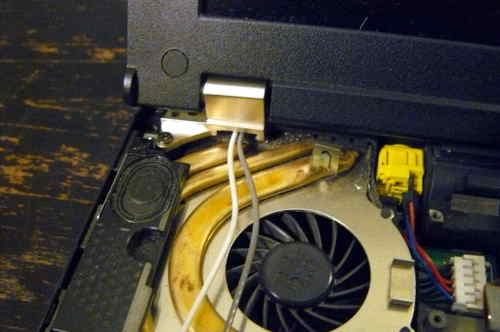

Disconnect the LCD cable from the motherboard:\
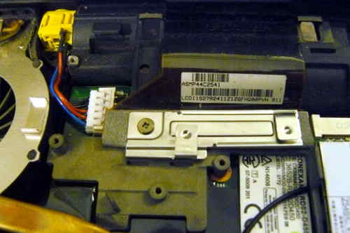 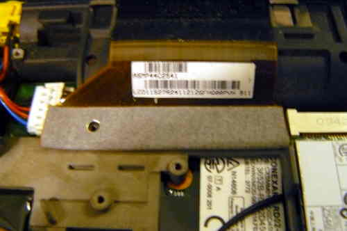
 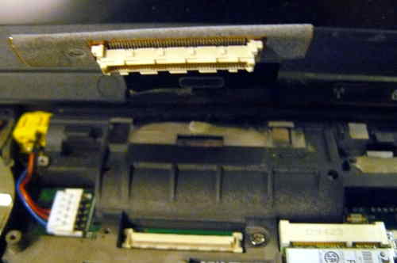

Remove the hinge screws, and then remove the LCD panel:\
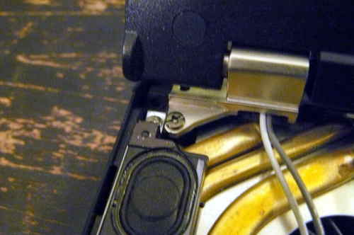 
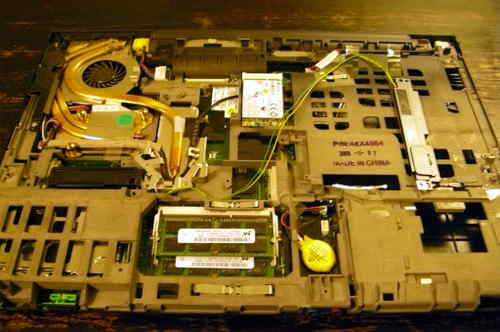 

Remove this:\
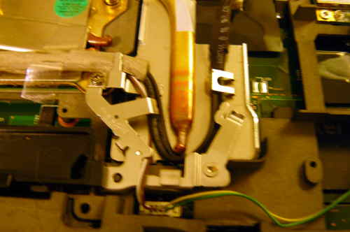 

Remove this long cable (there are 3 connections):\
 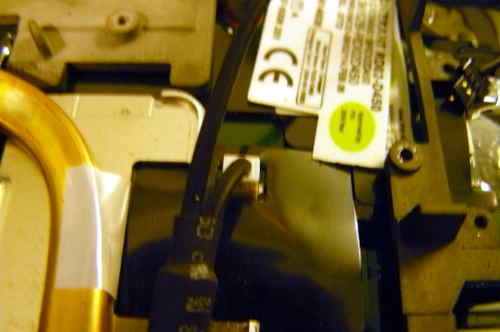
 

Disconnect the speaker cable, and remove the speakers:\
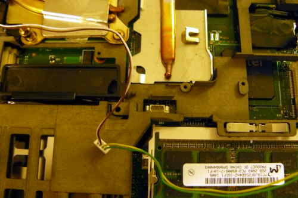

Remove the heatsink screws, remove the fan and then remove the
heatsink/fan:\
 
 

Remove the NVRAM battery:\
 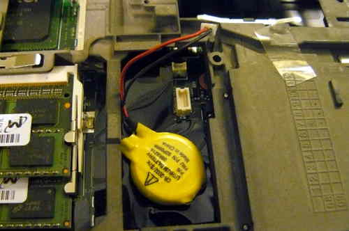

Remove this screw:\
 

Disconnect the AC jack:\
 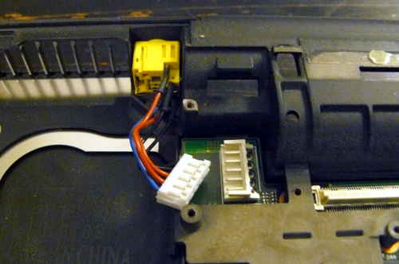

Remove this screw and then remove what is under it:\

Remove this:\

Lift the motherboard (which is still inside the cage) from the side on
the right, removing it completely:\
 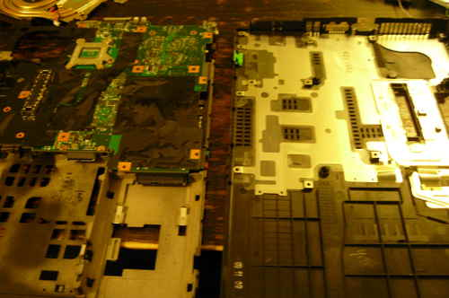

Remove all screws, marking each hole so that you know where to re-insert
them. You should place the screws in a layout corresponding to the order
that they were in before removal: 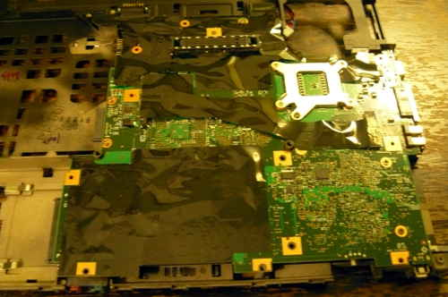
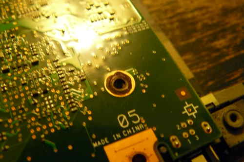

Remove the motherboard from the cage, and the SPI flash chip will be
next to the memory slots:\
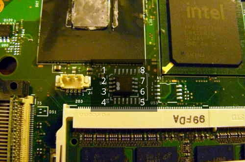 

Connect your programmer, then connect GND and 3.3V\
 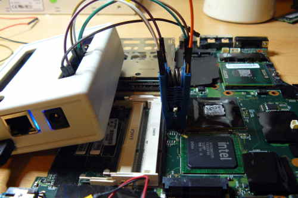
 
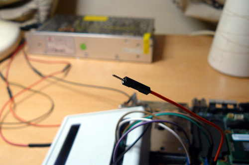 

A dedicated 3.3V PSU was used to create this guide, but at ATX PSU is
also fine:\
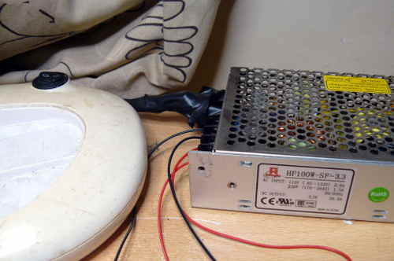

Of course, make sure to turn on your PSU:\

Now, you should be ready to install libreboot.

Flashrom binaries for ARM (tested on a BBB) are distributed in
libreboot\_util. Alternatively, libreboot also distributes flashrom
source code which can be built.

Log in as root on your BBB, using the instructions in
[bbb\_setup.html\#bbb\_access](bbb_setup.html#bbb_access).

Test that flashrom works:

    # ./flashrom -p linux_spi:dev=/dev/spidev1.0,spispeed=512

In this case, the output was:

    flashrom v0.9.7-r1854 on Linux 3.8.13-bone47 (armv7l)
    flashrom is free software, get the source code at http://www.flashrom.org
    Calibrating delay loop... OK.
    Found Macronix flash chip "MX25L6405(D)" (8192 kB, SPI) on linux_spi.
    Found Macronix flash chip "MX25L6406E/MX25L6436E" (8192 kB, SPI) on linux_spi.
    Found Macronix flash chip "MX25L6445E/MX25L6473E" (8192 kB, SPI) on linux_spi.
    Multiple flash chip definitions match the detected chip(s): "MX25L6405(D)", "MX25L6406E/MX25L6436E", "MX25L6445E/MX25L6473E"
    Please specify which chip definition to use with the -c <chipname> option.

How to backup factory.rom (change the -c option as neeed, for your flash
chip):

    # ./flashrom -p linux_spi:dev=/dev/spidev1.0,spispeed=512 -r factory.rom

    # ./flashrom -p linux_spi:dev=/dev/spidev1.0,spispeed=512 -r factory1.rom

    # ./flashrom -p linux_spi:dev=/dev/spidev1.0,spispeed=512 -r factory2.rom

Note: the `-c` option is not required in libreboot's patched
flashrom, because the redundant flash chip definitions in *flashchips.c*
have been removed.

Now compare the 3 images:

    # sha512sum factory*.rom

If the hashes match, then just copy one of them (the factory.rom) to a
safe place (on a drive connected to another system, not the BBB). This
is useful for reverse engineering work, if there is a desirable
behaviour in the original firmware that could be replicated in coreboot
and libreboot.

While there is a default MAC address inside the gbe region of flash image,
it is not one you want to use. Make sure to change the MAC address to the one
that is correct for your system, for **later internal flash**,
but always remember to **flash unmodfied txtmode image first** as it is known
to work and only this variant provides memtest. You can follow instructions
at [../hardware/gm45\_remove\_me.html\#ich9gen](../hardware/gm45_remove_me.html#ich9gen)
to change the MAC address inside the libreboot image.

Now flash it:

    # ./flashrom -p linux_spi:dev=/dev/spidev1.0,spispeed=512 -w path/to/libreboot/rom/image.rom -V

You might see errors, but if it says `Verifying flash... VERIFIED` at
the end, then it's flashed and should boot. If you see errors, try
again (and again, and again); the message `Chip content is identical to
the requested image` is also an indication of a successful
installation.

Example output from running the command (see above):

    flashrom v0.9.7-r1854 on Linux 3.8.13-bone47 (armv7l)
    flashrom is free software, get the source code at http://www.flashrom.org
    Calibrating delay loop... OK.
    Found Macronix flash chip "MX25L6405(D)" (8192 kB, SPI) on linux_spi.
    Reading old flash chip contents... done.
    Erasing and writing flash chip... FAILED at 0x00001000! Expected=0xff, Found=0x00, failed byte count from 0x00000000-0x0000ffff: 0xd716
    ERASE FAILED!
    Reading current flash chip contents... done. Looking for another erase function.
    Erase/write done.
    Verifying flash... VERIFIED.

Thermal paste (IMPORTANT)
=========================

Because part of this procedure involved removing the heatsink, you will
need to apply new paste. Arctic MX-4 is ok. You will also need isopropyl
alcohol and an anti-static cloth to clean with.

When re-installing the heatsink, you must first clean off all old paste
with the alcohol/cloth. Then apply new paste. Arctic MX-4 is also much
better than the default paste used on these systems.

NOTE: the photo above is for illustration purposes only, and does not
show how to properly apply the thermal paste. Other guides online detail
the proper application procedure.

Wifi
====

The R400 typically comes with an Intel wifi chipset, which does not work
without proprietary software. For a list of wifi chipsets that work
without proprietary software, see
[../hardware/\#recommended\_wifi](../hardware/#recommended_wifi).

Some R400 laptops might come with an Atheros chipset, but this is
802.11g only.

It is recommended that you install a new wifi chipset. This can only be
done after installing libreboot, because the original firmware has a
whitelist of approved chips, and it will refuse to boot if you use an
'unauthorized' wifi card.

The following photos show an Atheros AR5B95 being installed, to replace
the Intel chip that this R400 came with:\
 

WWAN
====

If you have a WWAN/3G card and/or sim card reader, remove them
permanently. The WWAN-3G card has proprietary firmware inside; the
technology is identical to what is used in mobile phones, so it can also
track your movements.

Not to be confused with wifi (wifi is fine).

Memory
======

In DDR3 machines with Cantiga (GM45/GS45/PM45), northbridge requires sticks
that will work as PC3-8500 (faster PC3/PC3L sticks can work as PC3-8500).
Non-matching pairs may not work. Single module (meaning, one of the slots
will be empty) will currently only work in slot 0.

NOTE: according to users reports, non matching pairs (e.g. 1+2 GiB) might
work in some cases.

Make sure that the RAM you buy is the 2Rx8 configuration when buying 4GiB sticks
(In other words: maximum of 2GiB per rank, 2 ranks per card).

[This page](http://www.forum.thinkpads.com/viewtopic.php?p=760721) might
be useful for RAM compatibility info (note: coreboot raminit is
different, so this page might be BS)

The following photo shows 8GiB (2x4GiB) of RAM installed:\

Boot it!
--------

You should see something like this:

 

Now [install GNU+Linux](../gnulinux/).

Copyright © 2014, 2015 Leah Rowe <info@minifree.org>\
Copyright © 2018 Nico Rikken <nico@nicorikken.eu>\

Permission is granted to copy, distribute and/or modify this document
under the terms of the GNU Free Documentation License Version 1.3 or any later
version published by the Free Software Foundation
with no Invariant Sections, no Front Cover Texts, and no Back Cover Texts.
A copy of this license is found in [../fdl-1.3.md](../fdl-1.3.md)
