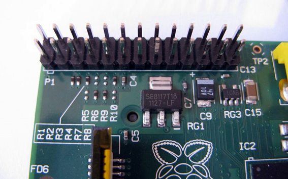
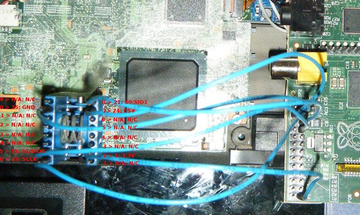

---
title: How to program an SPI flash chip with the Raspberry Pi
...

This document exists as a guide for reading from or writing to an SPI flash
chip with the Raspberry Pi, using the [flashrom](http://flashrom.org/Flashrom)
software. Most revisions of the RPi should work.

The Libreboot project recommends using
[blobless GNU+Linux](https://blog.rosenzweig.io/blobless-linux-on-the-pi.html)
on the Raspberry Pi, to avoid having to run non-free software. This only became
possible in February 2017 and the instructions below are not yet updated with
the necessary steps, so please do not follow the steps below unless you are
willing to run non-free software on your Raspberry Pi.

This only covers SOIC-8 flash chips, for now. SOIC-16 guide coming later (for
now, it should be easy enough for you to figure this out for SOIC-16).

Raspberry Pi (ThinkPad X60/T60 and Macbook 2,1)
------------------------------------------------

The Raspberry Pi (a $25 single board computer - SBC) can be used as a 25xx
flashing tool.

### Disassembling the ThinkPad

Follow the [X60 Hardware Maintenance
Manual](http://download.lenovo.com/ibmdl/pub/pc/pccbbs/mobiles_pdf/42x3550_04.pdf)
or [T60 Hardware Maintenance
Manual](http://download.lenovo.com/ibmdl/pub/pc/pccbbs/mobiles_pdf/42t7844_04.pdf)
to disassemble the laptop, until you can access the 25xx flash chip.

For photos, follow the [Libreboot T60 Recovery
Guide](t60_unbrick.md).

-   On the X60, the 25xx flash chip is on the bottom of the motherboard, under
    a layer of protective black tape.

-   On the T60, the 25xx flash chip is just under the palmrest, but blocked by
    a magnesium frame (which you will have to remove).

### Pomona Clip Pinout

Diagram of the 26 GPIO Pins of the Raspberry Pi Model B (for the Model
B+ with 40 pins, start counting from the right and leave 14 pins):

 

     25xx flash location in X60 (APPLIES ONLY TO X60!):

    ~~~~ LCD (Front) ~~~~
            8765
            ----
            |  |
            ----
            1234
    ~~~ Palmrest (back) ~~

  Pin \#   25xx signal     [Raspberry Pi](images/rpi/0000.jpg)
  -------- --------------  -------------------------------------
  1        CS              24
  2        MISO            21
  3        *not used*      *not used*
  4        GND             25
  5        MOSI            19
  6        CLK             23
  7        *not used*      *not used*
  8        3.3V

Make sure the pinouts are correct; otherwise, Flashrom will fail to
detect a chip, or it will "detect" a `0x0` chip. Finally, make sure
that the Pomona clip makes contact with the metal wires of the chip. It
can be a challenge, but keep trying.

### How to supply power to the flash chip

There are two ways to supply power to the chip: plugging in an AC
adapter (without turning the laptop on), and using the 8th 3.3v pin.

*Never connect both the 8th pin and the AC adapter at the same time.*

Reading the Flashchip
----------------------

First, visually inspect (with a magnifying glass) the type of flashchip
on the motherboard.

Next, download and install latest flashrom on the Raspberry Pi.

    sudo apt-get install build-essential pciutils usbutils libpci-dev libusb-dev libftdi1 libftdi-dev zlib1g-dev subversion libusb-1.0-0-dev flashrom
    sudo modprobe spi_bcm2708
    sudo modprobe spidev

Run this command to see if 25xx flash is detected

    sudo ./flashrom -p linux_spi:dev=/dev/spidev0.0,spispeed=2000

If flash chip is detected you may try flashing Libreboot now.

Flashing Libreboot
-------------------

Note: replace `/path/to/libreboot.rom` with the location of your chosen ROM,
such as `../bin/x60/libreboot_usqwerty.rom`):

Next, run this command:

    sudo ./flashrom -p linux_spi:dev=/dev/spidev0.0,spispeed=2000 -w /path/to/libreboot.rom

Once that command outputs the following, the flash has completed
successfully. If not, just flash again.

    Reading old flash chip contents... done.
    Erasing and writing flash chip... Erase/write done.
    Verifying flash... VERIFIED.

### Sources

-   [Scruss - Simple ADC with the RaspberryPi](http://scruss.com/blog/2013/02/02/simple-adc-with-the-raspberry-pi/)
-   [Flashing coreboot on a T60 with a Raspberry Pi - the\_unconventional's blog](https://web.archive.org/web/20150709043222/http://blogs.fsfe.org:80/the_unconventional/2015/05/08/coreboot-t60-raspberry-pi/)

Raspberry Pi (ThinkPad X200)
-----------------------------

### Requirements:

-   Raspberry Pi and peripherals
-   Relevant SOIC clip
-   6 female - female jumpers
-   Internet connection
-   Screw drivers

Follow the [ThinkPad X200: Initial installation guide](x200_external.md) to
disassemble the laptop, and access the 25xx flash chip.

If you're running Raspian, you can do **sudo raspi-config**, enable SPI
under Advanced and then spidev will be enabled. Simple, eh?

[Download Libreboot from their releases
page](../../download/). For your safety, verify the
GPG signature as well.

    $ gpg --keyserver prefered.keyserver.org --recv-keys 0x656F212E

    $ for signature in $(ls *.sig); do gpg --verify $signature; done

Chip model name

Pinout. You may want to download the image so you can zoom in on the
text.

  Pin \#   25xx signal    Raspberry Pi Pin \#
  -------- -------------- ---------------------
  1        *not used*     *not used*
  2        3.3V           1
  3        *not used*     *not used*
  4        *not used*     *not used*
  5        *not used*     *not used*
  6        *not used*     *not used*
  7        CS\#           24
  8        MISO           21
  9        *not used*     *not used*
  10       GND            25
  11       *not used*     *not used*
  12       *not used*     *not used*
  13       *not used*     *not used*
  14       *not used*     *not used*
  15       MOSI           19
  16       SCLK           23

Note: The raspberry pi 3.3V rail is not sufficient to power the board during
flashing, so external power supply might be required.

At this point connect your SOIC clip to the flash chip before powering on
your Pi.

Power on your Pi, and run the following. Ensure you swap out
"your\_chip\_name" with the proper name/model of your chip. Check that
it can be read successfully. If you cannot read the chip and receive an
error similar to "no EEPROM Detected" then
you may want to make sure that MISO/MOSI are not swapped around, check
with multimeter whether voltage is right and that ground is connected
between "programmer" and target.

    pi# cd ~/flashrom

    pi# ./flashrom -p linux_spi:dev=/dev/spidev0.0,spispeed=2000 --chip <your_chip_name> -r romread1.rom

    pi# ./flashrom -p linux_spi:dev=/dev/spidev0.0,spispeed=2000 --chip <your_chip_name> -v romread1.rom

    pi# ./flashrom -p linux_spi:dev=/dev/spidev0.0,spispeed=2000 --chip <your_chip_name> -v romread1.rom

If they are identical (verified) then you can generally assume that you get
same data each time (which might be bogus).

    pi# ./flashrom -p linux_spi:dev=/dev/spidev0.0,spispeed=2000 --chip <your_chip_name> -w libreboot.rom

It may fail a couple times, but keep at it and when you get the message
`Verifying flash... Verified` or
`Warning: Chip content is identical to the requested image` then you're
done.

Shut down your pi, put your box back together, and run memtest before
instaling operating system

### Sources

-   *Pomona SOIC Clip flashing*
    -   [Flashrom page on RPi](http://www.flashrom.org/RaspberryPi)
    -   [Arch Linux Wiki - Installing Arch Linux on
        Chromebook](https://wiki.archlinux.org/index.php/Chromebook)
    -   [Google Drive - Raspberry Pi SOIC Clip
        connection](https://drive.google.com/folderview?id=0B9f62MH0umbmRTA2Xzd5WHhjWEU&usp=sharing)
    -   [rPI with Flashrom and SOIC Clip
        Powerpoint](http://satxhackers.org/wp/hack-content/uploads/2013/04/rPI_flashrom.pdf)
    -   [Tnhh - Unbricking Chromebook with
        Beaglebone](http://www.tnhh.net/2014/08/25/unbricking-chromebook-with-beaglebone.md)
-   *Use a DIY DIP System to flash an desoldered 25xx flash chip*
    -   [Viktak - How to recover laptop after failed BIOS
        flash](http://diy.viktak.com/2014/07/how-to-recover-laptop-after-failed-bios.md)
    -   [Win-Raid - Recover from Failed BIOS Flashing using Raspberry
        Pi](http://www.win-raid.com/t58f16-Guide-Recover-from-failed-BIOS-flash-using-Raspberry-PI.md)

Copyright © 2014, 2015 Lawrence Wu <sagnessagiel@gmail.com>\
Copyright © 2015 snuffeluffegus <>\
Copyright © 2015 Kevin Keijzer <>\
Copyright © 2016 Leah Rowe <info@minifree.org>\

This page is available under the [CC BY SA 4.0](../cc-by-sa-4.0.txt)
