---
title: ThinkPad T60 Recovery guide
x-toc-enable: true
...

This section documents how to recover from a bad flash that prevents
your ThinkPad T60 from booting.

Brick type 1: bucts not reset. {#bucts_brick}
==============================

You still have Lenovo BIOS, or you had libreboot running and you flashed
another ROM; and you had bucts 1 set and the ROM wasn't dd'd.\* or if
Lenovo BIOS was present and libreboot wasn't flashed.\

In this case, unbricking is easy: reset BUC.TS to 0 by removing that
yellow cmos coin (it's a battery) and putting it back after a minute or
two:\
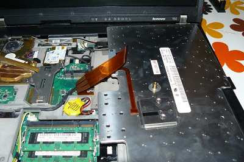\

\*Those dd commands should be applied to all newly compiled T60 ROM
images (the ROM images in libreboot binary archives already have this
applied!):\
dd if=coreboot.rom of=top64k.bin bs=1 skip=\$\[\$(stat -c %s
coreboot.rom) - 0x10000\] count=64k\
dd if=coreboot.rom bs=1 skip=\$\[\$(stat -c %s coreboot.rom) - 0x20000\]
count=64k | hexdump\
dd if=top64k.bin of=coreboot.rom bs=1 seek=\$\[\$(stat -c %s
coreboot.rom) - 0x20000\] count=64k conv=notrunc\
(doing this makes the ROM suitable for use when flashing a system that
still has Lenovo BIOS running, using those instructions:
<http://www.coreboot.org/Board:lenovo/x60/Installation>. (it says x60,
but instructions for t60 are identical)

bad rom (or user error), system won't boot {#recovery}
===========================================

In this scenario, you compiled a ROM that had an incorrect
configuration, or there is an actual bug preventing your system from
booting. Or, maybe, you set BUC.TS to 0 and shut down after first flash
while Lenovo BIOS was running. In any case, your system is bricked and
will not boot at all.

"Unbricking" means flashing a known-good (working) ROM. The problem:
you can't boot the system, making this difficult. In this situation,
external hardware (see hardware requirements above) is needed which can
flash the SPI chip (where libreboot resides).

Remove those screws and remove the HDD:\
 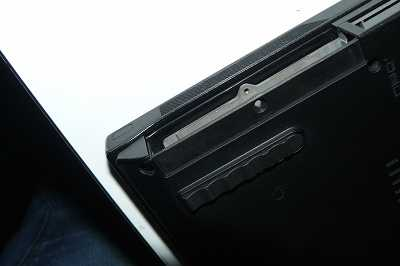

Lift off the palm rest:\
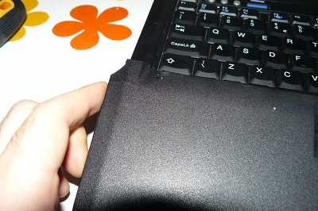

Lift up the keyboard, pull it back a bit, flip it over like that and
then disconnect it from the board:\
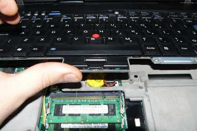 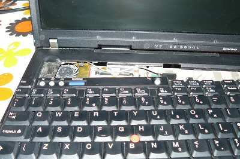

Gently wedge both sides loose:\
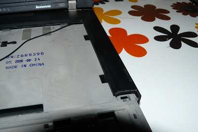 

Remove that cable from the position:\
 

Now remove that bezel. Remove wifi, nvram battery and speaker connector
(also remove 56k modem, on the left of wifi):\

Remove those screws:\
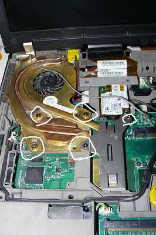

Disconnect the power jack:\
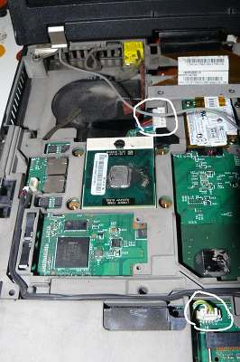

Remove nvram battery:\
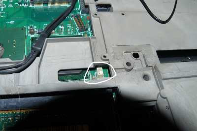

Disconnect cable (for 56k modem) and disconnect the other cable:\
 

Disconnect speaker cable:\
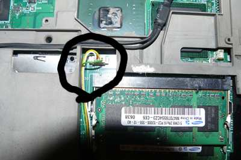

Disconnect the other end of the 56k modem cable:\
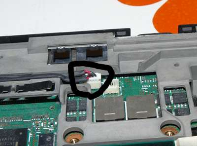

Make sure you removed it:\
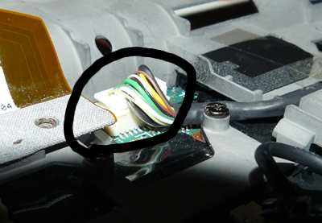

Unscrew those:\
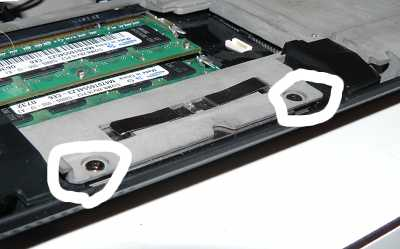

Make sure you removed those:\
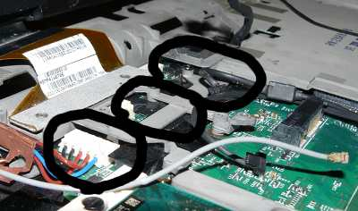

Disconnect LCD cable from board:\

Remove those screws then remove the LCD assembly:\
 
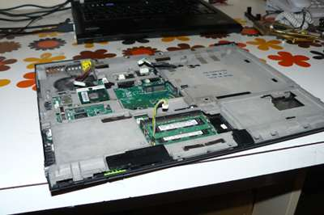

Once again, make sure you removed those:\

Remove the shielding containing the motherboard, then flip it over.
Remove these screws, placing them on a steady surface in the same layout
as they were in before you removed them. Also, you should mark each
screw hole after removing the screw (a permanent marker pen will do),
this is so that you have a point of reference when re-assembling the
system:

 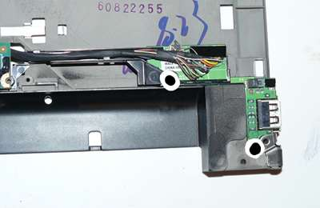
 
 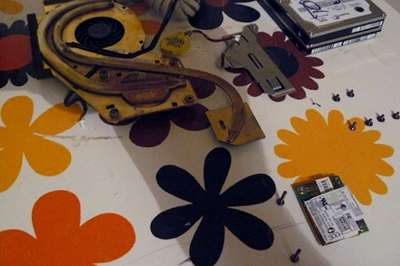

Now wire up the BBB and the Pomona with your PSU.\
Refer to [bbb\_setup.md](bbb_setup.md) for how to setup the BBB for
flashing.

*Note, the guide mentions a 3.3v DC PSU but you don't need this on the
T60: if you don't have or don't want to use an external PSU, then make
sure not to connect the 3.3v leads mentioned in the guide; instead,
connect the AC adapter (the one that normally charges your battery) so
that the board has power (but don't boot it up)*

Correlate the following with the BBB guide linked above:

    POMONA 5250:
    ===  DVD drive ====
     18              -       - 1
     22              -       - NC               ---- RAM is on this end
     NC              -       - 21
     3.3V (PSU)      -       - 17 - this is pin 1 on the flash chip
    ===  audio jacks ===
    This is how you will connect. Numbers refer to pin numbers on the BBB, on the plugs near the DC jack.

Connect the pomona from the BBB to the flash chip. No pics
unfortunately. (use the text diagram above).

Flashrom binaries for ARM (tested on a BBB) are distributed in
libreboot\_util. Alternatively, libreboot also distributes flashrom
source code which can be built.

SSH'd into the BBB:

    # ./flashrom -p linux_spi:dev=/dev/spidev1.0,spispeed=512 -w yourrom.rom

It should be `Verifying flash... VERIFIED` at the end. If flashrom
complains about multiple flash chip definitions detected, then choose
one of them following the instructions in the output.

Put those screws back:\
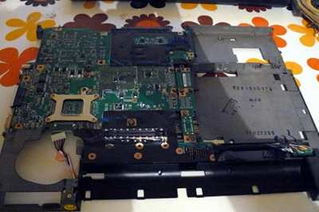

Put it back into lower chassis:\

Attach LCD and insert screws (also, attach the lcd cable to the board):\
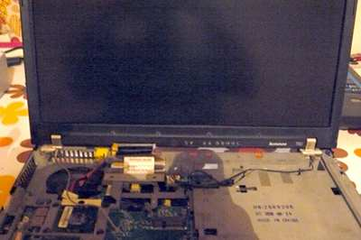

Insert those screws:\
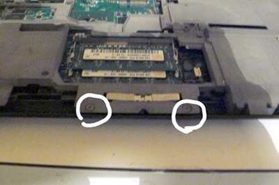

On the CPU (and there is another chip south-east to it, sorry forgot to
take pic) clean off the old thermal paste (with the alcohol) and apply
new (Artic Silver 5 is good, others are good too) you should also clean
the heatsink the same way\
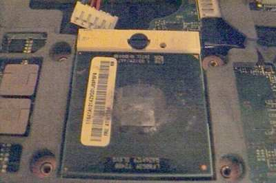

Attach the heatsink and install the screws (also, make sure to install
the AC jack as highlighted):\

Reinstall that upper bezel:\

Do that:\
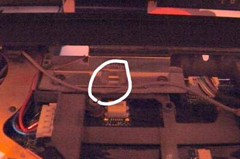 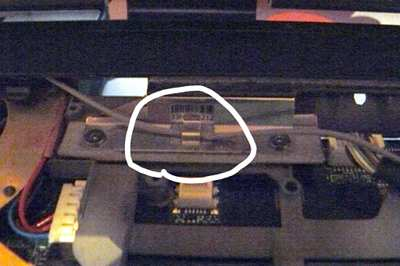

Re-attach modem, wifi, (wwan?), and all necessary cables. Sorry, forgot
to take pics. Look at previous removal steps to see where they go back
to.

Attach keyboard and install nvram battery:\
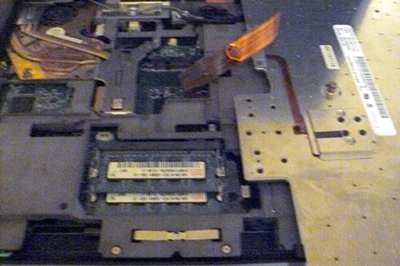 

Place keyboard and (sorry, forgot to take pics) reinstall the palmrest
and insert screws on the underside:\
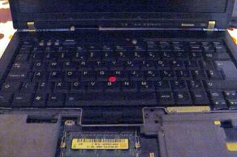

It lives!\
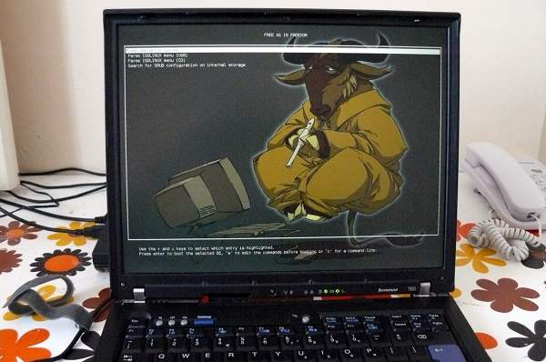 
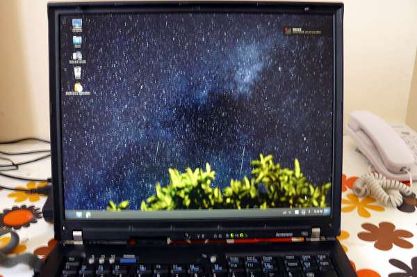

Always stress test ('stress -c 2' and xsensors. below 90C is ok) when
replacing cpu paste/heatsink:\

Copyright © 2014, 2015 Leah Rowe <info@minifree.org>\

Permission is granted to copy, distribute and/or modify this document
under the terms of the GNU Free Documentation License Version 1.3 or any later
version published by the Free Software Foundation
with no Invariant Sections, no Front Cover Texts, and no Back Cover Texts.
A copy of this license is found in [../fdl-1.3.md](../fdl-1.3.md)
