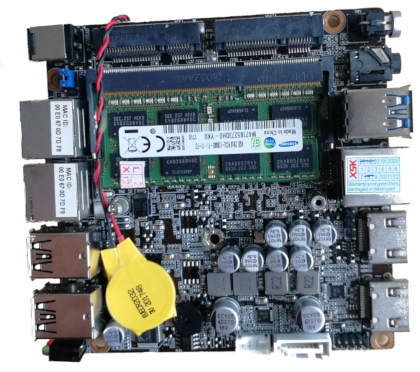
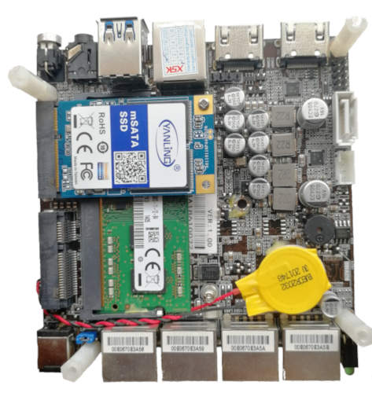

# Protectli Vault FW2B and FW4B

This page describes how to run coreboot on the [Protectli FW2B] and
[Protectli FW4B].


## Required proprietary blobs

To build a minimal working coreboot image some blobs are required (assuming
only the BIOS region is being modified).

```eval_rst
+-----------------+---------------------------------+---------------------+
| Binary file     | Apply                           | Required / Optional |
+=================+=================================+=====================+
| FSP             | Intel Firmware Support Package  | Required            |
+-----------------+---------------------------------+---------------------+
| microcode       | CPU microcode                   | Required            |
+-----------------+---------------------------------+---------------------+
| vgabios         | VGA Option ROM                  | Optional            |
+-----------------+---------------------------------+---------------------+
```

FSP is automatically added by coreboot build system into the image) from the
`3rdparty/fsp` submodule.

microcode updates are automatically included into the coreboot image by build
system from the `3rdparty/intel-microcode` submodule.

VGA Option ROM is not required to boot, but if one needs graphics in pre-OS
stage, it should be included.

## Flashing coreboot

### Internal programming

The main SPI flash can be accessed using [flashrom].

### External programming

The system has an internal flash chip which is a 8 MiB soldered SOIC-8 chip.
This chip is located on the bottom side of the case (the radiator side). One
has to remove all screws (in order): 4 top cover screws, 4 side cover screws
(one side is enough), 4 mainboard screws, 3 CPU screws (under the DIMM). Lift
up the mainboard and turn around it. The flash chip is near the mainboard edge
close to the Ethernet Controllers. Use a clip (or solder the wires) to program
the chip. **Watch out on the voltage, the SPI operates at 1.8V!** Specifically,
it's a Macronix MX25U6435F (1.8V) - [datasheet][MX25U6435F].

## Known issues

- After flashing with external programmer the board will not boot if flashed
  the BIOS region only. For some reason it is required to flash whole image
  along with TXE region.
- USB 3.0 ports get detected very late in SeaBIOS, it needs huge timeout
  values in order to get the devices detected.

## Untested

Not all mainboard's peripherals and functions were tested because of lack of
the cables or not being populated on the board case.

- internal USB 2.0 header

## Working

- USB 3.0 front ports (SeaBIOS and Linux)
- 4 Ethernet ports (2 Ethernet ports on FW2B)
- 2 HDMI ports with VGA Option ROM
- 2 HDMI ports with libgfxinit
- flashrom
- PCIe WiFi
- SATA and mSATA
- Super I/O serial port 0 (RS232 via front RJ45 connector)
- SMBus (reading SPD from DIMMs)
- initialization with Braswell FSP
- SeaBIOS payload (version rel-1.13.0)

- booting Debian, Ubuntu, FreeBSD

## Not working

- mPCIe debug card connected to mSATA (mSATA slot has LPC signals routed,
  however for some reason the debug card is not powered)

## Technology

The mainboard has two variants: FW2B and FW4B. They have different Braswell
SoC. The FW2B replaces 2 out of 4 Ethernet Controllers with 4 USB ports
connected via [FE1.1 USB 2.0 hub].

- FW2B:

```eval_rst
+------------------+--------------------------------------------------+
| CPU              | Intel Celeron J3060                              |
+------------------+--------------------------------------------------+
| PCH              | Braswell                                         |
+------------------+--------------------------------------------------+
| Super I/O        | ITE IT8613E                                      |
+------------------+--------------------------------------------------+
| Coprocessor      | Intel Trusted Execution Engine                   |
+------------------+--------------------------------------------------+
```



- FW4B:

```eval_rst
+------------------+--------------------------------------------------+
| CPU              | Intel Celeron J3160                              |
+------------------+--------------------------------------------------+
| PCH              | Braswell                                         |
+------------------+--------------------------------------------------+
| Super I/O        | ITE IT8613E                                      |
+------------------+--------------------------------------------------+
| Coprocessor      | Intel Trusted Execution Engine                   |
+------------------+--------------------------------------------------+
```



[Protectli FW2B]: https://protectli.com/vault-2-port/
[Protectli FW4B]: https://protectli.com/product/fw4b/
[MX25U6435F]: https://www.macronix.com/Lists/Datasheet/Attachments/7411/MX25U6435F,%201.8V,%2064Mb,%20v1.5.pdf
[FE1.1 USB 2.0 hub]: https://cdn-shop.adafruit.com/product-files/2991/FE1.1s+Data+Sheet+(Rev.+1.0).pdf
[flashrom]: https://flashrom.org/Flashrom
