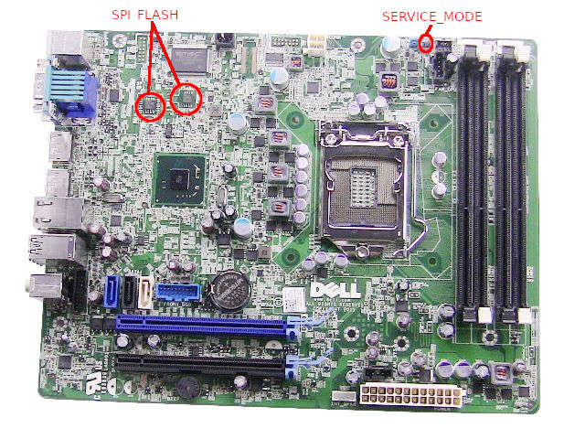

# Dell OptiPlex 9010

This page describes how to run coreboot on Dell OptiPlex 9010 SFF.



## Technology

```eval_rst
+------------+---------------------------------------------------------------+
| CPU        | Intel Core 2nd Gen (Sandybridge) or 3rd Gen (Ivybridge)       |
+------------+---------------------------------------------------------------+
| DRAM       | Up to 4 DIMM slots, up to 32GB 1600MHz non-ECC DDR3 SDRAM     |
+------------+---------------------------------------------------------------+
| Chipset    | Intel Q77 Express                                             |
+------------+---------------------------------------------------------------+
| Super I/O  | SMSC SCH5545 (or SCH5544) with Environmental Controller       |
+------------+---------------------------------------------------------------+
| TPM        | ST Microelectronics ST33ZP24                                  |
+------------+---------------------------------------------------------------+
| Boot       | From USB, SATA, NVMe (using PCIe x4 expansion card)           |
+------------+---------------------------------------------------------------+
| Power      | 200W-275W PSU                                                 |
+------------+---------------------------------------------------------------+
```

More specifications on [Dell OptiPlex 9010 specifications].

## Required proprietary blobs

```eval_rst
+------------------+---------------------------------+---------------------+
| Binary file      | Apply                           | Required / Optional |
+==================+=================================+=====================+
| smsc_sch5545.bin | SMSC SCH5545 EC                 | Optional            |
+------------------+---------------------------------+---------------------+
| microcode        | CPU microcode                   | Required            |
+------------------+---------------------------------+---------------------+
```

Microcode updates are automatically included into the coreboot image by build
system from the `3rdparty/intel-microcode` submodule.

SMSC SC5545 EC firmware is optional, however lack of the binary will result in
EC malfunction after power failure and fans running at full speed. The blob can
be extracted from original firmware. It should be located under a file with
GUID D386BEB8-4B54-4E69-94F5-06091F67E0D3, raw section. The file begins with a
signature `SMSCUBIM`. The easiest way to do this is to use [UEFITool] and
`Extract body` option on the raw section of the file.

## Flashing coreboot

```eval_rst
+---------------------+--------------------------+
| Type                | Value                    |
+=====================+==========================+
| Socketed flash      | no                       |
+---------------------+--------------------------+
| Model               | MX25L6406E/MX25L3206E    |
+---------------------+--------------------------+
| Size                | 8 + 4 MiB                |
+---------------------+--------------------------+
| Package             | SOIC-16 + SOIC-8         |
+---------------------+--------------------------+
| Write protection    | chipset PRR              |
+---------------------+--------------------------+
| Dual BIOS feature   | no                       |
+---------------------+--------------------------+
| Internal flashing   | yes                      |
+---------------------+--------------------------+
```

### Internal programming

The SPI flash can be accessed using [flashrom].

    flashrom -p internal -w coreboot.rom --ifd -i bios

Internal programming will not work when migrating from original UEFI firmware.
One will have to short the SERVICE_MODE jumper to enable HMRFPO and then boot
the machine to flash it.

### External programming

The external access to flash chip is available through standard SOP-8 clip
and/or SOP-16 clip on the right side of the CPU fan (marked on the board
image). The voltage of SPI flash is 3.3V.

There are no restrictions as to the programmer device. It is only recommended
to flash firmware without supplying power. There are no diodes connected to the
flash chips. External programming can be performed, for example using OrangePi
and Armbian. You can use linux_spi driver which provides communication with SPI
devices. Example command to program SPI flash with OrangePi using linux_spi:

    flashrom -w coreboot.rom -p linux_spi:dev=/dev/spidev1.0,spispeed=16000

## Schematics

There are no schematics for SFF, but if one looks for MT/DT schematics, they
can be found publicly. Most of the schematics should match the SFF (although
MT/DT has additional PCIe and PCI slot).

## Known issues

- There seems to be a problem with DRAM clearing on reboot. The SSKPD register
  still contains 0xCAFE which leads to reset loop.

## Untested

Not all mainboard's peripherals and functions were tested because of lack of
the cables or not being populated on the board case.

- Internal USB 2.0 header
- Wake from S3 using serial port
- Wake-on-Lan from ACPI S4/S5

## Working

- USB 3.0 and 2.0 rear and front ports (SeaBIOS and Linux 4.19)
- Gigabit Ethernet
- VGA and 2x DP port using libgfxinit
- flashrom
- PCIe x1 WiFi in PCIe x4 slot
- NVMe PCIe x4 using PCIe x4 expansion card
- PCIe x16 PEG port using Dell Radeon HD 7570
- SATA ports (SATA disks and DVD)
- Super I/O serial port 0 (RS232 DB9 connector on the rear side)
- SMBus (reading SPD from DIMMs)
- CPU initialization using Intel i7-3770
- Sandy Bridge/Ivy Bridge native RAM initialization
- SeaBIOS payload (version rel-1.13.0)
- PS/2 keyboard and mouse (including wake support)
- LPC debug header (requires soldering of the pin header and shorting RF24 for
  LPC clock)
- USB debug dongle (the most bottom USB 2.0 port under RJ45 on the read side)
- SMSC SCH5545 Super I/O initialization
- SMSC SCH5545 EC initialization and firmware update
- SMSC SCH5545 EC automatic fan control
- TPM 1.2
- Booting Debian 10, Ubuntu 18.04, QubesOS R4.01
- Boot with cleaned ME
- Intruder detection
- Wake-on-Lan from ACPI S3

[flashrom]: https://flashrom.org/Flashrom
[Dell OptiPlex 9010 specifications]: https://www.dell.com/downloads/global/products/optix/en/dell_optiplex_9010_spec_sheet.pdf
[UEFITool]: https://github.com/LongSoft/UEFITool
