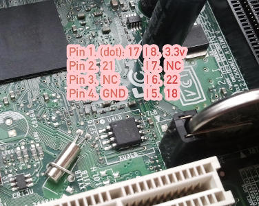

---
title: D510MO flashing tutorial 
...

This guide is for those who want libreboot on their Intel D510MO
motherboard while they still have the original BIOS present.

Flash chip size {#flashchips}
===============

Use this to find out:

    # flashrom -p internal

Flashing instructions {#clip}
=====================

Refer to [bbb\_setup.md](bbb_setup.md) for how to set up the BBB for
flashing.

This is an image of the flash chip, for reference:\

Copyright © 2016 Leah Rowe <info@minifree.org>\

Permission is granted to copy, distribute and/or modify this document
under the terms of the GNU Free Documentation License Version 1.3 or any later
version published by the Free Software Foundation
with no Invariant Sections, no Front Cover Texts, and no Back Cover Texts.
A copy of this license is found in [../fdl-1.3.md](../fdl-1.3.md)
