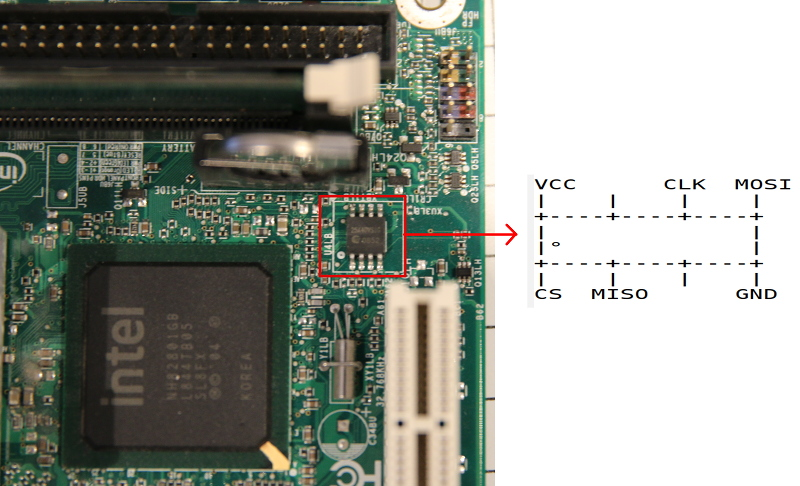

---
title: Intel D945GCLF flashing tutorial 
...

This guide is for those who want libreboot on their Intel D945GCLF
motherboard while they still have the original BIOS present.

For information about this board, go to
[../hardware/d945gclf.md](../hardware/d945gclf.md)

Flashing instructions {#clip}
=====================

Refer to [bbb\_setup.md](bbb_setup.md) for how to set up the BBB for
external flashing.

Here is an image of the flash chip:\

Copyright © 2016 Leah Rowe <info@minifree.org>\

Permission is granted to copy, distribute and/or modify this document
under the terms of the GNU Free Documentation License Version 1.3 or any later
version published by the Free Software Foundation
with no Invariant Sections, no Front Cover Texts, and no Back Cover Texts.
A copy of this license is found in [../fdl-1.3.md](../fdl-1.3.md)
