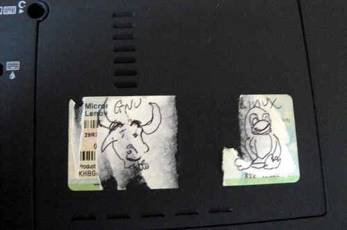
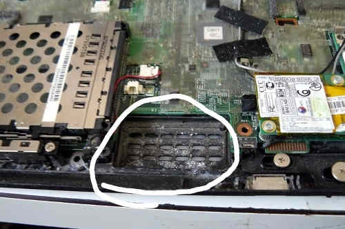
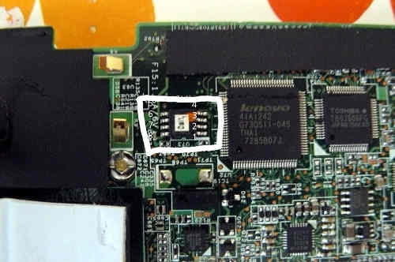

---
title: ThinkPad X60 Tablet Recovery guide
x-toc-enable: true
...

This section documents how to recover from a bad flash that prevents
your ThinkPad X60 Tablet from booting.

Brick type 1: bucts not reset. {#bucts_brick}
==============================

You still have Lenovo BIOS, or you had libreboot running and you flashed
another ROM; and you had bucts 1 set and the ROM wasn't dd'd.\* or if
Lenovo BIOS was present and libreboot wasn't flashed.\

In this case, unbricking is easy: reset BUC.TS to 0 by removing that
yellow cmos coin (it's a battery) and putting it back after a minute or
two:\
\

\*Those dd commands should be applied to all newly compiled X60 ROM
images (the ROM images in libreboot binary archives already have this
applied!):

    dd if=coreboot.rom of=top64k.bin bs=1 skip=\$\[\$(stat -c %s coreboot.rom) - 0x10000\] count=64k
    dd if=coreboot.rom bs=1 skip=\$\[\$(stat -c %s coreboot.rom) - 0x20000\] count=64k | hexdump
    dd if=top64k.bin of=coreboot.rom bs=1 seek=\$\[\$(stat -c %s coreboot.rom) - 0x20000\] count=64k conv=notrunc

(doing this makes the ROM suitable for use when flashing a system that
still has Lenovo BIOS running, using those instructions:
<http://www.coreboot.org/Board:lenovo/x60/Installation>.

bad rom (or user error), system won't boot {#recovery}
===========================================

In this scenario, you compiled a ROM that had an incorrect
configuration, or there is an actual bug preventing your system from
booting. Or, maybe, you set BUC.TS to 0 and shut down after first flash
while Lenovo BIOS was running. In any case, your system is bricked and
will not boot at all.

"Unbricking" means flashing a known-good (working) ROM. The problem:
you can't boot the system, making this difficult. In this situation,
external hardware (see hardware requirements above) is needed which can
flash the SPI chip (where libreboot resides).

Remove those screws:\

Remove the HDD:\

Push keyboard forward to loosen it:\

Lift:\

Remove those:\

Also remove that (marked) and unroute the antenna cables:\

For some X60T laptops, you have to unroute those too:\

Remove the LCD extend board screws. Also remove those screws (see blue
marks) and remove/unroute the cables and remove the metal plate:\

Remove that screw and then remove the board:\

Now wire up the BBB and the Pomona with your PSU.\
Refer to [bbb\_setup.md](bbb_setup.md) for how to setup the BBB for
flashing.\
*Note, the guide mentions a 3.3v DC PSU but you don't need this on the
X60 Tablet: if you don't have or don't want to use an external PSU,
then make sure not to connect the 3.3v leads mentioned in the guide;
instead, connect the AC adapter (the one that normally charges your
battery) so that the board has power (but don't boot it up)*
\
Correlate the following with the BBB guide linked above:

    POMONA 5250:
    ===  golden finger and wifi switch ====
     18              -       - 1
     22              -       - NC                    ---------- audio jacks are on this end
     NC              -       - 21
     3.3V (PSU)      -       - 17 - this is pin 1 on the flash chip
    ===  CPU fan ===
    This is how you will connect. Numbers refer to pin numbers on the BBB, on the plugs near the DC jack.

Connecting the BBB and pomona (in this image, an external 3.3v DC PSU
was used):\

Flashrom binaries for ARM (tested on a BBB) are distributed in
libreboot\_util. Alternatively, libreboot also distributes flashrom
source code which can be built.

SSH'd into the BBB:

    # ./flashrom -p linux_spi:dev=/dev/spidev1.0,spispeed=512 -w yourrom.rom

It should be `Verifying flash... VERIFIED` at the end. If flashrom
complains about multiple flash chip definitions detected, then choose
one of them following the instructions in the output.

Reverse the steps to re-assemble your system.

Copyright © 2014, 2015 Leah Rowe <info@minifree.org>\

Permission is granted to copy, distribute and/or modify this document
under the terms of the GNU Free Documentation License Version 1.3 or any later
version published by the Free Software Foundation
with no Invariant Sections, no Front Cover Texts, and no Back Cover Texts.
A copy of this license is found in [../fdl-1.3.md](../fdl-1.3.md)
