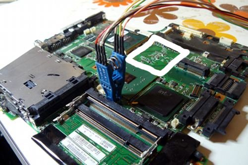

---
title: Hardware compatibility list 
x-toc-enable: true
...

This sections relates to known hardware compatibility in libreboot.

For installation instructions, refer to [../install/](../install/).

List of supported hardware
--------------------------

Libreboot supports the following systems in this release:

### Desktops (AMD, Intel, x86)

-   [Gigabyte GA-G41M-ES2L motherboard](ga-g41m-es2l.md)
-   [Intel D510MO and D410PT motherboards](d510mo.md)
-   [Intel D945GCLF](d945gclf.md)
-   [Apple iMac 5,2](imac52.md)

### Servers/workstations (AMD, x86)

-   [ASUS KCMA-D8 motherboard](kcma-d8.md)
-   [ASUS KGPE-D16 motherboard](kgpe-d16.md)
-   [ASUS KFSN4-DRE motherboard](kfsn4-dre.md)

### Laptops (ARM)

-   [ASUS Chromebook C201](c201.md)

### Laptops (Intel, x86)

-   [Lenovo ThinkPad X60/X60s](#list-of-supported-thinkpad-x60s)
-   [Lenovo ThinkPad X60 Tablet](#list-of-supported-thinkpad-x60-tablets)
-   [Lenovo ThinkPad T60](#supported-t60-list) (some exceptions)
-   [Lenovo ThinkPad X200](x200.md)
-   [Lenovo ThinkPad R400](r400.md)
-   [Lenovo ThinkPad T400](t400.md)
-   [Lenovo ThinkPad T500](t500.md)
-   [Lenovo ThinkPad W500](t500.md)
-   [Apple MacBook1,1](#information-about-the-macbook11)
-   [Apple MacBook2,1](#information-about-the-macbook21)

'Supported' means that the build scripts know how to build ROM images
for these systems, and that the systems have been tested (confirmed
working). There may be exceptions; in other words, this is a list of
'officially' supported systems.

EC update on i945 (X60, T60) and GM45 (X200, T400, T500, R400, W500)
==============================================================

It is recommended that you update to the latest EC firmware version. The
[EC firmware](../../faq.md#ec-embedded-controller-firmware) is separate from
libreboot, so we don't actually provide that, but if you still have
Lenovo BIOS then you can just run the Lenovo BIOS update utility, which
will update both the BIOS and EC version. See:

-   [../install/#flashrom](../install/#flashrom)
-   <http://www.thinkwiki.org/wiki/BIOS_update_without_optical_disk>

NOTE: this can only be done when you are using Lenovo BIOS. How to
update the EC firmware while running libreboot is unknown. Libreboot
only replaces the BIOS firmware, not EC.

Updated EC firmware has several advantages e.g. better battery
handling.

How to find what EC version you have (i945/GM45)
================================================

In GNU+Linux, you can try this:

    $ grep 'at EC' /proc/asound/cards

Sample output:

    ThinkPad Console Audio Control at EC reg 0x30, fw 7WHT19WW-3.6

7WHT19WW is the version in different notation, use search engine to find
out regular version - in this case it's a 1.06 for x200 tablet

Recommended wifi chipsets
-------------------------

The following are known to work well:

-   mini PCI express cards using the Atheros AR9285 chipset (e.g.
    Atheros AR5B95) - 802.11n
-   USB dongles using the AR9271 chipset (e.g. Unex DNuA 93-F) - 802.11n
-   Any of the chipsets listed at
    <https://h-node.org/wifi/catalogue/en/1/1/undef/undef/yes?>

The following was mentioned (on IRC), but it's unknown to the libreboot
project if these work with linux-libre kernel (TODO: test):

-   ar5bhb116 ar9382 ABGN
-   \[0200\]: Qualcomm Atheros AR242x / AR542x Wireless Network Adapter
    (PCI-Express) \[168c:001c\]

List of supported ThinkPad X60s
-------------------------------

Native gpu initialization ('native graphics') which replaces the
proprietary VGA Option ROM ('[Video
BIOS](https://en.wikipedia.org/wiki/Video_BIOS)' or 'VBIOS'), all
known LCD panels are currently compatible:

Only panels with EDID are currently supported, see:
[../misc/\#get\_edid\_panelname](../misc/#get_edid_panelname).

-   TMD-Toshiba LTD121ECHB: \#
-   CMO N121X5-L06: \#
-   Samsung LTN121XJ-L07: \#
-   BOE-Hydis HT121X01-101: \#

You can remove an X61/X61s motherboard from the chassis and install an
X60/X60s motherboard in it's place (for flashing libreboot). The
chassis is mostly identical and the motherboards are the same
shape/size.

The X60 typically comes with an Intel wifi chipset which does not work
at all without proprietary firmware, and while Lenovo BIOS is running
the system will refuse to boot if you replace the card. Fortunately it
is very easily replaced; just remove the card and install another one
*after* libreboot is installed. See
[\#recommended\_wifi](#recommended_wifi) for replacements.

List of supported ThinkPad X60 Tablets
--------------------------------------

Native gpu initialization ('native graphics') which replaces the
proprietary VGA Option ROM ('[Video
BIOS](https://en.wikipedia.org/wiki/Video_BIOS)' or 'VBIOS').

Only panels with EDID are currently supported, see:
[../misc/\#get\_edid\_panelname](../misc/#get_edid_panelname).

There are 6 known LCD panels for the X60 Tablet:

-   *X60T XGA (1024x768):*
    -   BOE-Hydis HV121X03-100 (works)
    -   Toshiba Matsushita LTD121KC9B (works)
    -   Samsung LTN121XP01 (does not work. blank screen)
    -   BOE-Hydis HT12X21-351 (does not work. blank screen)
-   *X60T SXGA+ (1400x1050):*
    -   BOE-Hydis HV121P01-100 (works)
    -   BOE-Hydis HV121P01-101 (works)

Most X60Ts only have digitizer (pen), but some have finger (touch)
as well as pen.

You can remove an X61/X61s motherboard from the chassis and install an
X60/X60s motherboard in its place (for flashing libreboot). The chassis
is mostly identical and the motherboards are the same shape/size. *It
is unknown if the same applies between the X60 Tablet and the X61
Tablet*.

The X60 Tablet typically comes with an Intel wifi chipset which does not
work at all without proprietary firmware, and while Lenovo BIOS is
running the system will refuse to boot if you replace the card.
Fortunately it is very easily replaced; just remove the card and install
another one *after* libreboot is installed. See
[\#recommended\_wifi](#recommended_wifi) for replacements.

A user with a X60T that has digitizer+finger support, reported that they
could get finger input working. They used linuxwacom at git tag
0.25.99.2 and had the following in their xorg.conf:

    # Now, for some reason (probably a bug in linuxwacom),
    # the 'Touch=on' directive gets reset to 'off'.
    # So you'll need to do
    # $ xsetwacom --set WTouch Touch on
    #
    # tested with linuxwacom git 42a42b2a8636abc9e105559e5dea467163499de7

    Section "Monitor"
         Identifier             "<default monitor>"
         DisplaySize     245 184
    EndSection

    Section "Screen"
         Identifier "Default Screen Section"
         Monitor    "<default monitor<"
    EndSection

    Section "InputDevice"
         Identifier  "WTouch"
         Driver      "wacom"
         Option      "Device" "/dev/ttyS0"
    #    Option      "DebugLevel" "12"
         Option      "BaudRate" "38400"
         Option      "Type" "touch"
         Option      "Touch" "on"
         Option      "Gesture" "on"
         Option      "ForceDevice" "ISDV4"
    #    Option      "KeepShape" "on"
         Option      "Mode" "Absolute"
         Option      "RawSample" "2"
    #    Option      "TPCButton" "off"
         Option      "TopX" "17"
         Option      "TopY" "53"
         Option      "BottomX" "961"
         Option      "BottomY" "985"
    EndSection

    Section "ServerLayout"
      Identifier    "Default Layout"
      Screen        "Default Screen Section"
      InputDevice   "WTouch" "SendCoreEvents"
    EndSection

Supported T60 list
------------------

Native gpu initialization ('native graphics') which replaces the
proprietary VGA Option ROM ('[Video
BIOS](https://en.wikipedia.org/wiki/Video_BIOS)' or 'VBIOS').

Only panels with EDID are currently supported, see:
[../misc/\#get\_edid\_panelname](../misc/#get_edid_panelname).

*Some T60 variants have ATI GPUs, and all T60p laptops have ATI GPUs These are
incompatible! See [\#thinkpad-t60-ati-gpu-and-thinkpad-t60-intel-gpu-differences](#thinkpad-t60-ati-gpu-and-thinkpad-t60-intel-gpu-differences) for how to remedy
this.*

Tested LCD panels: (working)

-   IDtech N141XC (14.1" 1024x768)
-   TMD-Toshiba LTD141ECMB (14.1" 1024x768)
-   TMD-Toshiba LTD141EN9B (14.1" 1400x1050) (FRU P/N 41W1478 recommended for
    the inverter board)
-   Samsung LTN141P4-L02 (14.1" 1400x1050) (FRU P/N 41W1478 recommended for the
    inverter board)
-   LG-Philips LP150E05-A2K1 (15.1" 1400x1050) (P/N 42T0078 FRU 42T0079 or P/N
    41W1338 recommended for the inverter board)
-   Samsung LTN150P4-L01 (15.1" 1400x1050) (P/N 42T0078 FRU 42T0079 or P/N
    41W1338 recommended for the inverter board) (not a T60 screen afaik, but it
    works)
-   BOE-Hydis HV150UX1-100 (15.1" 1600x1200) (P/N 42T0078 FRU 42T0079 or P/N
    41W1338 recommended for the inverter board)
-   Samsung LTN141XA-L01 (14.1" 1024x768)
-   Samsung LTN154X3-L0A (15.4" 1280x800)
-   Samsung LTN154AT07-N01 (15.4" 1280x800)
-   LG-Philips LP154W01-TLAC (15.4" 1280x800)

Tested LCD panels: *not working yet (incompatible; see
[Issue \#677](https://notabug.org/libreboot/libreboot/issues/677))*

-   LG-Philips LP150X09 (15.1" 1024x768)
-   Samsung LTN150XG (15.1" 1024x768)
-   LG-Philips LP150E06-A5K4 (15.1" 1400x1050) (also, not an official
    T60 screen)
-   IDtech IAQX10N (15.1" 2048x1536) (no display in GRUB, display in
    GNU+Linux is temperamental) (P/N 42T0078 FRU 42T0079 or P/N 41W1338
    recommended for the inverter board)
-   IDtech N150U3-L01 (15.1" 1600x1200) (no display in GRUB, display in
    GNU+Linux works) (P/N 42T0078 FRU 42T0079 or P/N 41W1338 recommended
    for the inverter board)

*The following LCD panels are untested. If you have one of these panels then
please submit a report!*:

-   BOE-Hydis HT14X14 (14.1" 1024x768)
-   Boe-Hydis HT14P12 (14.1" 1400x1050) (FRU P/N 41W1478 recommended
    for the inverter board)
-   CMO (IDtech?) 13N7068 (15.1" 1024x768)
-   CMO (IDtech?) 13N7069 (15.1" 1024x768)
-   BOE-Hydis HV150P01-100 (15.1" 1400x1050) (P/N 42T0078 FRU 42T0079
    or P/N 41W1338 recommended for the inverter board)
-   BOE-Hydis HV150UX1-102 (15.1" 1600x1200) (P/N 42T0078 FRU 42T0079
    or P/N 41W1338 recommended for the inverter board)
-   IDtech IAQX10S (15.1" 2048x1536) (P/N 42T0078 FRU 42T0079 or P/N
    41W1338 recommended for the inverter board)
-   Samsung LTN154P2-L05 (42X4641 42T0329) (15.4" 1680x1050)
-   LG-Philips LP154W02-TL10 (13N7020 42T0423) (15.4" 1680x1050)
-   LG-Philips LP154WU1-TLB1 (42T0361) (15.4" 1920x1200) *(for T61p
    but it might work in T60. Unknown!)*
-   Samsung LTN154U2-L05 (42T0408 42T0574) (15.4" 1920x1200) *(for
    T61p but it might work in T60. Unknown!)*

It is unknown whether the 1680x1050 (15.4") and 1920x1200 (15.4")
panels use a different inverter board than the 1280x800 panels.

The T60 typically comes with an Intel wifi chipset which does not work
at all without proprietary firmware, and while Lenovo BIOS is running
the system will refuse to boot if you replace the card. Fortunately it
is very easily replaced; just remove the card and install another one
*after* libreboot is installed. See
[\#recommended\_wifi](#recommended_wifi) for replacements.

ThinkPad T60/R60 dGPU (ATI GPU) and iGPU (Intel GPU) differences
----------------------------------------------------------------

If your T60 is a 14.1" or 15.1" model with an ATI GPU, it won't work
with libreboot by default but you can replace the motherboard with
another T60 motherboard that has an Intel GPU, and then libreboot should
work.

There is also a 15.4" T60 with Intel GPU.

Widescreen T60/R60 can come with either boards taking full space or
with non-widescreen motherboard and extension adapter for
UltraBay/hard drive connectors.

Note: the T60*p* laptops all have ATI graphics. The T60p laptops
cannot be used with libreboot under any circumstances.

The following T60 motherboard (see area highlighted in white) shows an
empty space where the ATI GPU would be (this particular motherboard has
an Intel GPU):\

The reason that the ATI GPU on T60 is unsupported is due to the VBIOS
(Video BIOS) which is non-free. The VBIOS for the Intel GPU on X60/T60
has been reverse engineered, and replaced with Free Software and so will
work in libreboot.

The 'Video BIOS' is what initializes graphics.

See: <https://en.wikipedia.org/wiki/Video_BIOS>.\
In fact, lack of free VBIOS in general is a big problem in coreboot, and
is one reason (among others) why many ports for coreboot are unsuitable
for libreboot's purpose.

Theoretically, the ThinkPad T60 with ATI GPU can work with libreboot and
have ROM images compiled for it, however in practise it would not be
usable as a laptop because there would be no visual display at all. That
being said, such a configuration is acceptable for use in a 'headless'
server setup (with serial and/or ssh console as the display).

Information about the macbook1,1
--------------------------------

There is an Apple laptop called the macbook1,1 from 2006 which uses the
same i945 chipset as the ThinkPad X60/T60. A developer ported the
[MacBook2,1](#information-about-the-macbook21) to coreboot, the ROM images also work on the
macbook1,1.

You can refer to [\#information-about-the-macbook21](#information-about-the-macbook21)
for most of this. Macbook2,1 laptops come with Core 2 Duo processors
which support 64-bit operating systems (and 32-bit). The MacBook1,1
uses Core Duo processors (supports 32-bit OS but not 64-bit), and it is
believed that this is the only difference.

It is believed that all models are compatible, listed here:

-   <http://www.everymac.com/ultimate-mac-lookup/?search_keywords=MacBook1,1>

### Compatible models

Specifically (Order No. / Model No. / CPU):

-   MA255LL/A / A1181 (EMC 2092) / Core Duo T2500 *(tested - working)*
-   MA254LL/A / A1181 (EMC 2092) / Core Duo T2400 *(tested - working)*
-   MA472LL/A / A1181 (EMC 2092) / Core Duo T2500 (untested)

Unbricking: [this page shows disassembly
guides](https://www.ifixit.com/Device/MacBook_Core_2_Duo) and mono's
page (see [\#information-about-the-macbook21](#information-about-the-macbook21))
shows the location of the SPI flash chip on the motherboard. [How to remove the motherboard](https://www.ifixit.com/Guide/MacBook+Core+2+Duo+PRAM+Battery+Replacement/529).

No method is yet known for flashing in GNU+Linux while the Apple
firmware is running. You will need to disassemble the system and flash
externally. Reading from flash seems to work. For external flashing,
refer to [../install/bbb\_setup.md](../install/bbb_setup.md).

Information about the macbook2,1
--------------------------------

There is an Apple laptop called the macbook2,1 from late 2006 or early
2007 that uses the same i945 chipset as the ThinkPad X60 and ThinkPad
T60. A developer ported coreboot to their macbook2,1, and now libreboot
can run on it.

Mono Moosbart is the person who wrote the port for macbook2,1.
Referenced below are copies (up to date at the time of writing,
20140630) of the pages that this person wrote when porting coreboot to
the macbook2,1. They are included here in case the main site goes down
for whatever reason, since they include a lot of useful information.

Backups created using wget:

    $ wget -m -p -E -k -K -np http://macbook.donderklumpen.de/
    $ wget -m -p -E -k -K -np http://macbook.donderklumpen.de/coreboot/

Use `-e robots=off` if using this trick for other sites and the site restricts
using robots.txt

### Installing GNU+Linux distributions (on Apple EFI firmware)

How to boot an ISO: burn it to a CD (like you would normally) and hold
down the Alt/Control key while booting. The bootloader will detect the
GNU+Linux CD as 'Windows' (because Apple doesn't think GNU+Linux
exists). Install it like you normally would. When you boot up again,
hold Alt/Control once more. The installation (on the HDD) will once
again be seen as 'Windows'. (it's not actually Windows, but Apple
likes to think that Apple and Microsoft are all that exist.) Now to
install libreboot, follow
[../install/\#flashrom\_macbook21](../install/#flashrom_macbook21).

### Coreboot wiki page

-   <https://www.coreboot.org/Board:apple/macbook21>

### Compatible models

It is believed that all models are compatible, listed here:

-   <http://www.everymac.com/ultimate-mac-lookup/?search_keywords=MacBook2,1>

Specifically (Order No. / Model No. / CPU):

-   MA699LL/A / A1181 (EMC 2121) / Intel Core 2 Duo T5600 *(tested -
    working)*
-   MA701LL/A / A1181 (EMC 2121) / Intel Core 2 Duo T7200 *(tested -
    working)*
-   MB061LL/A / A1181 (EMC 2139) / Intel Core 2 Duo T7200 (untested)
-   MA700LL/A / A1181 (EMC 2121) / Intel Core 2 Duo T7200 *(tested -
    working)*
-   MB063LL/A / A1181 (EMC 2139) / Intel Core 2 Duo T7400 (works)
-   MB062LL/A / A1181 (EMC 2139) / Intel Core 2 Duo T7400 *(tested -
    working)*

Also of interest:
[../git/\#config\_macbook21](../git/#config_macbook21).

Unbricking: [this page shows disassembly
guides](https://www.ifixit.com/Device/MacBook_Core_2_Duo) and mono's
page (see above) shows the location of the SPI flash chip on the
motherboard. [How to remove the
motherboard](https://www.ifixit.com/Guide/MacBook+Core+2+Duo+PRAM+Battery+Replacement/529).

For external flashing, refer to
[../install/bbb\_setup.md](../install/bbb_setup.md).

You need to replace OS X with GNU+Linux before flashing libreboot. (OSX
won't run at all in libreboot).

### Issues and solutions

There is one mouse button only, however multiple finger tapping
works. Battery life is poor compared to X60/T60. The Apple logo on the
back is a hole, exposing the backlight, which means that it glows. You
should [cover it up](http://cweiske.de/tagebuch/tuxbook.htm).

*The MacBook2,1 comes with a webcam which does not work with free
software. Webcams are a privacy and security risk; cover it up! Or
remove it.*

Further issues do have solutions:

#### Enable AltGr

The keyboard has a keypad enter instead of an AltGr. The first key on
the right side of the spacebar is the Apple "command" key. On its
right is the keypad enter. We can make it act as an AltGr.

If your operating system is Trisquel or other dpkg-based distribution,
there is an easy solution. Under root (or sudo) run

    # dpkg-reconfigure keyboard-configuration

and select the option "apple laptop", leave other settings as their
defaults until you are given the option "Use Keypad Enter as
AltGr". Select this. The keypad enter key will then act as an AltGr
everywhere.

For Parabola or other systemd-based distributions you can enable AltGr
manually. Simply add the line

    KEYMAP_TOGGLE=lv3:enter_switch

to the file /etc/vconsole.conf and then restart the computer.

#### Enable 3-finger tap

A user submitted a utility to enable 3-finger tap on this laptop. It's
available at *resources/utilities/macbook21-three-finger-tap* in the
libreboot git repository.

#### Make touchpad more responsive

Linux kernels of version 3.15 or lower might make the touchpad
extremely sluggish. A user reported that they could get better
response from the touchpad with the following in their xorg.conf:

    Section "InputClass"
     Identifier "Synaptics Touchpad"
     Driver "synaptics"
     MatchIsTouchpad "on"
     MatchDevicePath "/dev/input/event*"
     Driver "synaptics"
    # The next two values determine how much pressure one needs
    # for tapping, moving the cursor and other events.
     Option "FingerLow" "10"
     Option "FingerHigh" "15"
    # Do not emulate mouse buttons in the touchpad corners.
     Option "RTCornerButton" "0"
     Option "RBCornerButton" "0"
     Option "LTCornerButton" "0"
     Option "LBCornerButton" "0"
    # One finger tap = left-click
     Option "TapButton1" "1"
    # Two fingers tap = right-click
     Option "TapButton2" "3"
    # Three fingers tap = middle-mouse
     Option "TapButton3" "2"
    # Try to not count the palm of the hand landing on the touchpad
    # as a tap. Not sure if helps.
     Option "PalmDetect" "1"
    # The following modifies how long and how fast scrolling continues
    # after lifting the finger when scrolling
     Option "CoastingSpeed" "20"
     Option "CoastingFriction" "200"
    # Smaller number means that the finger has to travel less distance
    # for it to count as cursor movement. Larger number prevents cursor
    # shaking.
     Option "HorizHysteresis" "10"
     Option "VertHysteresis" "10"
    # Prevent two-finger scrolling. Very jerky movement
     Option "HorizTwoFingerScroll" "0"
     Option "VertTwoFingerScroll" "0"
    # Use edge scrolling
     Option "HorizEdgeScroll" "1"
     Option "VertEdgeScroll" "1"
    EndSection

Copyright © 2014, 2015, 2016 Leah Rowe <info@minifree.org>\
Copyright © 2017 Eemeli Blåsten <https://drblasten.com>\

Permission is granted to copy, distribute and/or modify this document
under the terms of the GNU Free Documentation License Version 1.3 or any later
version published by the Free Software Foundation
with no Invariant Sections, no Front Cover Texts, and no Back Cover Texts.
A copy of this license is found in [../fdl-1.3.md](../fdl-1.3.md)
