---
title: ThinkPad X60 Recovery guide
x-toc-enable: true
...

This section documents how to recover from a bad flash that prevents
your ThinkPad X60 from booting.

Brick type 1: bucts not reset. {#bucts_brick}
==============================

You still have Lenovo BIOS, or you had libreboot running and you flashed
another ROM; and you had bucts 1 set and the ROM wasn't dd'd.\* or if
Lenovo BIOS was present and libreboot wasn't flashed.\

In this case, unbricking is easy: reset BUC.TS to 0 by removing that
yellow cmos coin (it's a battery) and putting it back after a minute or
two:\
\

\*Those dd commands should be applied to all newly compiled X60 ROM
images (the ROM images in libreboot binary archives already have this
applied!):

    dd if=coreboot.rom of=top64k.bin bs=1 skip=\$\[\$(stat -c %s coreboot.rom) - 0x10000\] count=64k
    dd if=coreboot.rom bs=1 skip=\$\[\$(stat -c %s coreboot.rom) - 0x20000\] count=64k | hexdump
    dd if=top64k.bin of=coreboot.rom bs=1 seek=\$\[\$(stat -c %s coreboot.rom) - 0x20000\] count=64k conv=notrunc

(doing this makes the ROM suitable for use when flashing a system that
still has Lenovo BIOS running, using those instructions:
<http://www.coreboot.org/Board:lenovo/x60/Installation>.

bad rom (or user error), system won't boot {#recovery}
===========================================

In this scenario, you compiled a ROM that had an incorrect
configuration, or there is an actual bug preventing your system from
booting. Or, maybe, you set BUC.TS to 0 and shut down after first flash
while Lenovo BIOS was running. In any case, your system is bricked and
will not boot at all.

"Unbricking" means flashing a known-good (working) ROM. The problem:
you can't boot the system, making this difficult. In this situation,
external hardware (see hardware requirements above) is needed which can
flash the SPI chip (where libreboot resides).

Remove those screws:\

Push the keyboard forward (carefully):\

Lift the keyboard up and disconnect it from the board:\

Grab the right-hand side of the chassis and force it off (gently) and
pry up the rest of the chassis:\

You should now have this:\

Disconnect the wifi antenna cables, the modem cable and the speaker:\

Unroute the cables along their path, carefully lifting the tape that
holds them in place. Then, disconnect the modem cable (other end) and
power connection and unroute all the cables so that they dangle by the
monitor hinge on the right-hand side:\

Disconnect the monitor from the motherboard, and unroute the grey
antenna cable, carefully lifting the tape that holds it into place:\

Carefully lift the remaining tape and unroute the left antenna cable so
that it is loose:\
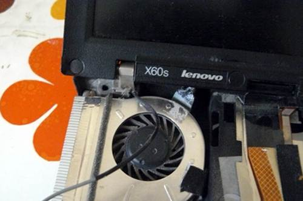

Remove the screw that is highlighted (do NOT remove the other one; it
holds part of the heatsink (other side) into place):\

Remove those screws:\
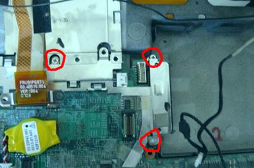

Carefully remove the plate, like so:\
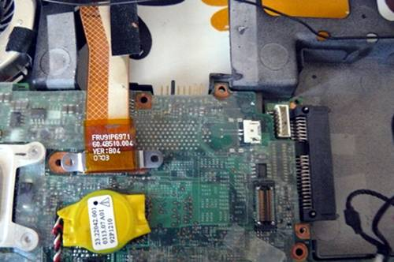

Remove the SATA connector:\

Now remove the motherboard (gently) and cast the lcd/chassis aside:\

Lift back that tape and hold it with something. Highlighted is the SPI
flash chip:\

Now wire up the BBB and the Pomona with your PSU.\
Refer to [bbb\_setup.md](bbb_setup.md) for how to setup the BBB for
flashing.\
*Note, the guide mentions a 3.3v DC PSU but you don't need this on the
X60: if you don't have or don't want to use an external PSU, then make
sure not to connect the 3.3v leads mentioned in the guide; instead,
connect the AC adapter (the one that normally charges your battery) so
that the board has power (but don't boot it up)*
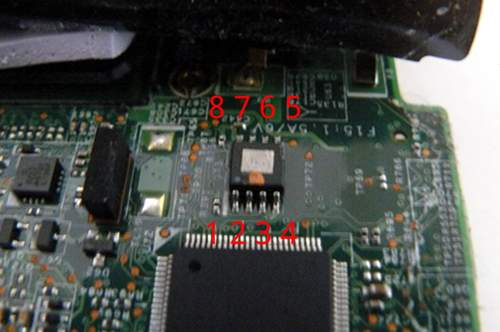\
Correlate the following with the BBB guide linked above:

    POMONA 5250:
    ===  golden finger and wifi switch ====
     18              -       - 1
     22              -       - NC                    ---------- audio jacks are on this end
     NC              -       - 21
     3.3V (PSU)      -       - 17 - this is pin 1 on the flash chip
    ===  CPU fan ===
    This is how you will connect. Numbers refer to pin numbers on the BBB, on the plugs near the DC jack.

Connecting the BBB and pomona (in this image, an external 3.3v DC PSU
was used):\
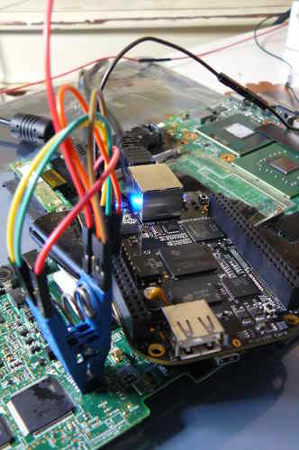

Flashrom binaries for ARM (tested on a BBB) are distributed in
libreboot\_util. Alternatively, libreboot also distributes flashrom
source code which can be built.

SSH'd into the BBB:

    # ./flashrom -p linux_spi:dev=/dev/spidev1.0,spispeed=512 -w yourrom.rom

It should be `Verifying flash... VERIFIED` at the end. If flashrom
complains about multiple flash chip definitions detected, then choose
one of them following the instructions in the output.

Remove the programmer and put it away somewhere. Put back the tape and
press firmly over it:\

Your empty chassis:\

Put the motherboard back in:\

Reconnect SATA:\
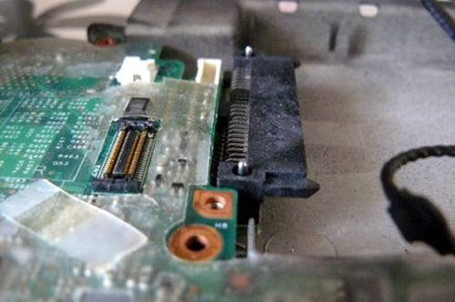

Put the plate back and re-insert those screws:\

Re-route that antenna cable around the fan and apply the tape:\
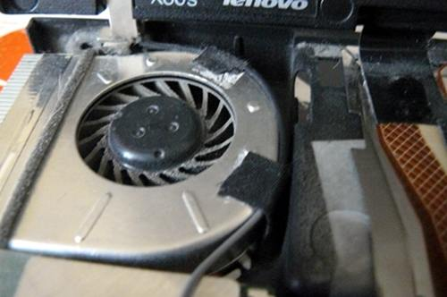

Route the cable here and then (not shown, due to error on my part)
reconnect the monitor cable to the motherboard and re-insert the
screws:\

Re-insert that screw:\

Route the black antenna cable like so:\

Tuck it in neatly like so:\
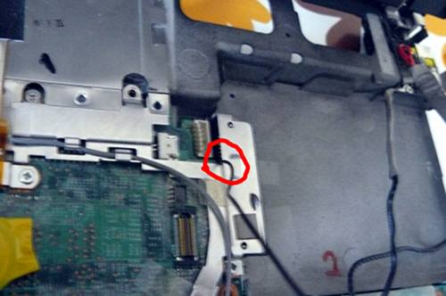

Route the modem cable like so:\
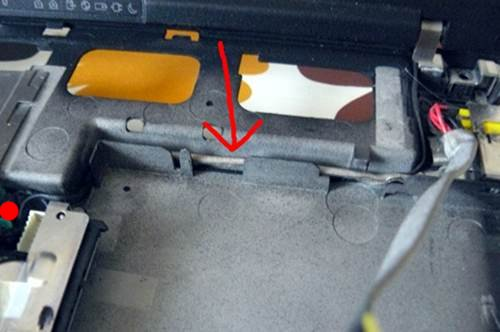

Connect modem cable to board and tuck it in neatly like so:\
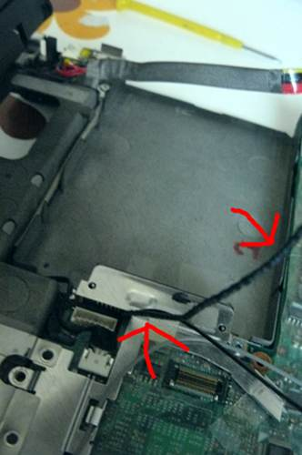

Route the power connection and connect it to the board like so:\

Route the antenna and modem cables neatly like so:\

Connect the wifi antenna cables. At the start of the tutorial, this
system had an Intel wifi chip. Here you see I've replaced it with an
Atheros AR5B95 (supports 802.11n and can be used without blobs):\

Connect the modem cable:\
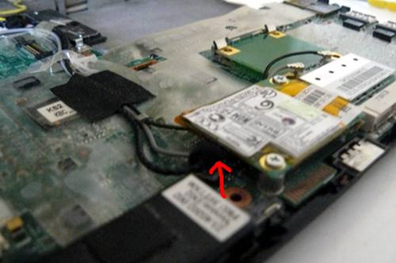

Connect the speaker:\

You should now have this:\

Re-connect the upper chassis:\

Re-connect the keyboard:\
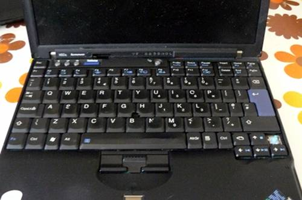

Re-insert the screws that you removed earlier:\

Power on!\

Operating system:\

Copyright © 2014, 2015 Leah Rowe <info@minifree.org>\

Permission is granted to copy, distribute and/or modify this document
under the terms of the GNU Free Documentation License Version 1.3 or any later
version published by the Free Software Foundation
with no Invariant Sections, no Front Cover Texts, and no Back Cover Texts.
A copy of this license is found in [../fdl-1.3.md](../fdl-1.3.md)
